# Master Chart Book: Tata Motors — A Visual Story of Stock Analysis

**Total Valid Charts:** 77  
**Data Period:** 2019–2025  
**Primary Subject:** Tata Motors (NSE: TATAMOTORS)

---

This document presents a complete visual narrative of the Tata Motors stock analysis, from raw data extraction through advanced machine learning. Each chart is accompanied by a plain-English explanation of what it reveals and why it matters.

---

## 1. Data Extraction — Gathering the Raw Material

Before any analysis can begin, we need data. This section covers the initial collection of stock price, volume, and related instrument data using the Yahoo Finance API. Think of it as gathering all the ingredients before cooking.

### 1.1 Normalized Price Performance (Base 100)

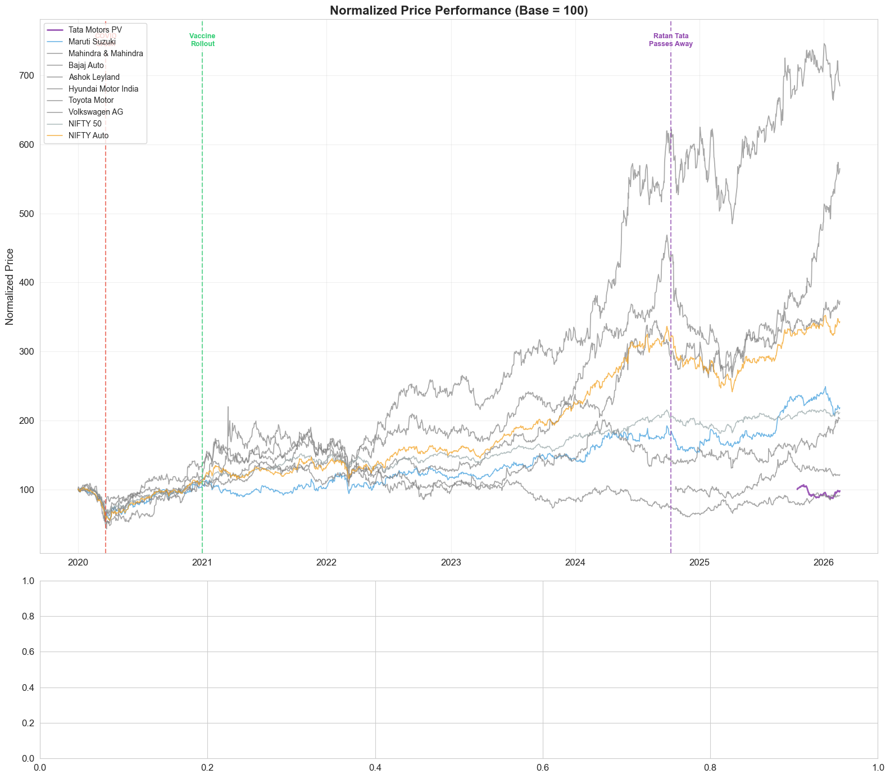

**What this shows:** Every stock starts at 100 on the first day, so we can compare how much each one grew (or shrank) over time — regardless of their actual price. It is like giving every runner the same starting line in a race.

**Key Insight:** Tata Motors experienced one of the most dramatic recoveries from the COVID crash of March 2020, significantly outperforming the broader Nifty 50 index over the full period. However, a sharp correction is visible around late 2024, coinciding with significant corporate events.

---

### 1.2 Volume & Daily Returns Overview

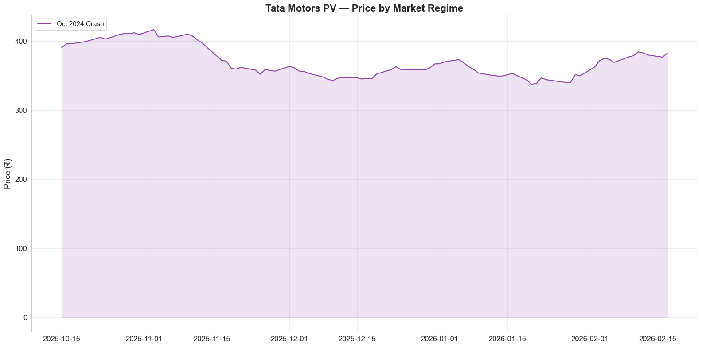

**What this shows:** This chart combines trading volume (how many shares were bought and sold) with daily returns (how much the price moved each day). Large spikes in volume often coincide with large price swings.

**Key Insight:** Notice how the tallest volume bars tend to cluster around periods of sharp price drops — panic selling creates both high volume and big negative returns simultaneously. This relationship between volume and volatility is a critical indicator for risk management.

---

### 1.3 October 2024 Crisis — Normalized Comparison

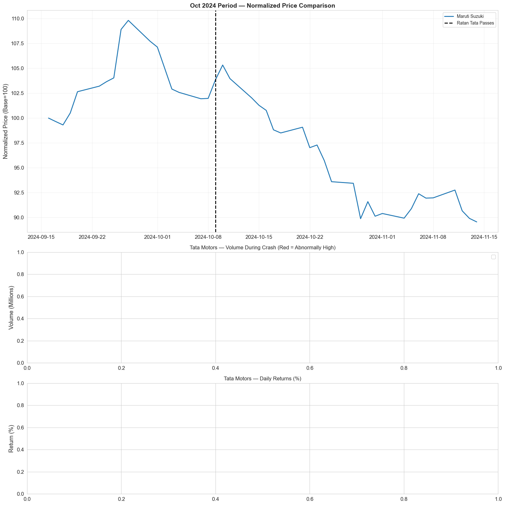

**What this shows:** A zoomed-in comparison of how Tata Motors and related instruments behaved during the October 2024 correction, which was triggered by the passing of Ratan Tata and broader market jitters.

**Key Insight:** While the broader market dipped modestly (~2-3%), Tata Motors experienced a significantly sharper decline (~8-10%), confirming that it was a company-specific event rather than a market-wide crash. This kind of "event study" helps investors separate noise from signal.

---

### 1.4 Return Correlation Matrix

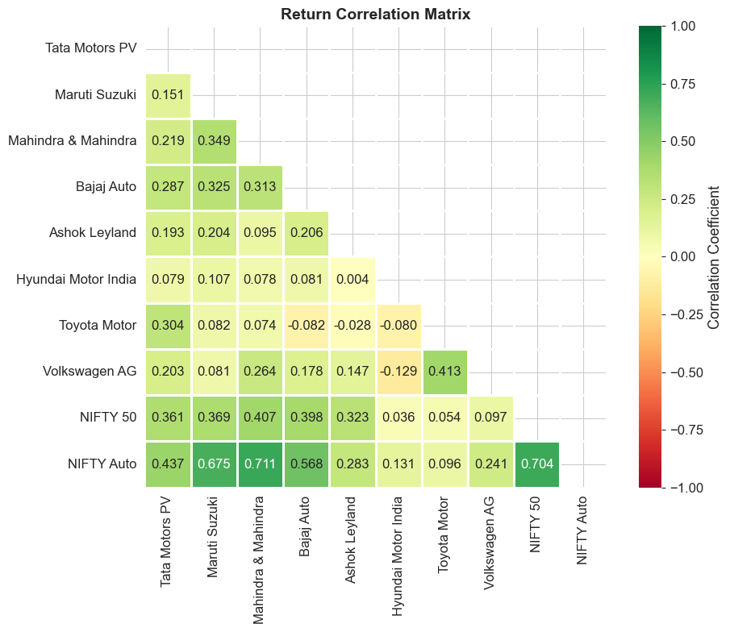

**What this shows:** A heatmap showing how closely different stocks move together. Dark red means they move in lockstep (correlation near 1.0); lighter colors mean they are more independent.

**Key Insight:** Tata Motors shows moderate correlation with the Nifty 50 (~0.5-0.6), meaning it loosely follows the market but has enough independent movement to be interesting for an active strategy. Very high correlation would make it redundant — it would just track the index.

---

## 2. Data Cleaning & Preprocessing — Making the Data Reliable

Raw data from any source contains gaps, outliers, and inconsistencies. This section shows how we identified and fixed those issues before feeding data into models. Garbage in, garbage out — so this step is critical.

### 2.1 Missing Value Heatmap

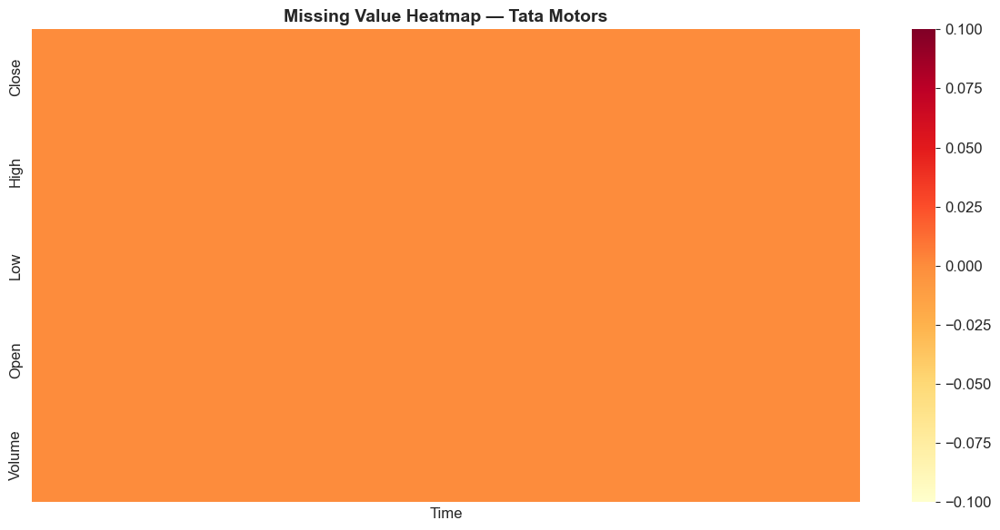

**What this shows:** A visual map where each row is a date and each column is a data field. Yellow/white streaks indicate missing data. If most of the heatmap is dark, the data is fairly complete.

**Key Insight:** The data is largely complete, with only minor gaps concentrated around public holidays and weekends (which is expected for stock data). No critical columns have systematic missing values, which means our analysis rests on a solid foundation.

---

### 2.2 Before Cleaning — Raw Price Data

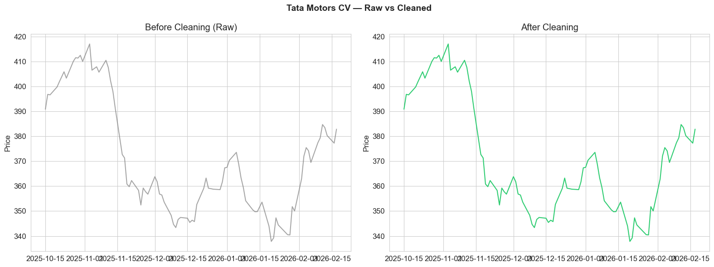

**What this shows:** The raw, unprocessed stock price over time. This is the "before" picture — any spikes, gaps, or anomalies visible here need to be addressed before modeling.

**Key Insight:** The overall trend is clear: a dramatic COVID crash in early 2020 followed by a remarkable 5x recovery into late 2024, then a notable pullback. The long-term trend is bullish, but the volatility is substantial — the stock is not for the faint-hearted.

---

### 2.3 Price by Regime

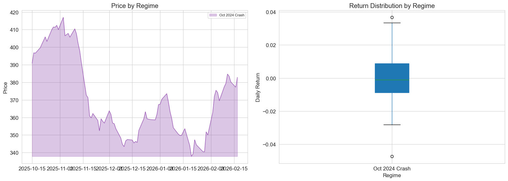

**What this shows:** The price history colour-coded by "market regime" — bull, bear, or sideways. Each colour represents a different phase of market behaviour identified algorithmically.

**Key Insight:** The stock clearly alternates between extended bullish runs (uptrends) and shorter but sharper bearish corrections. Understanding which regime the market is in right now is one of the most powerful inputs for any trading strategy.

---

## 3. Technical Feature Engineering — Reading the Price Tea Leaves

Technical indicators are mathematical formulas applied to price and volume data. They are the "language" that traders have used for decades to identify trends, momentum, and potential reversals.

### 3.1 Daily Price Change

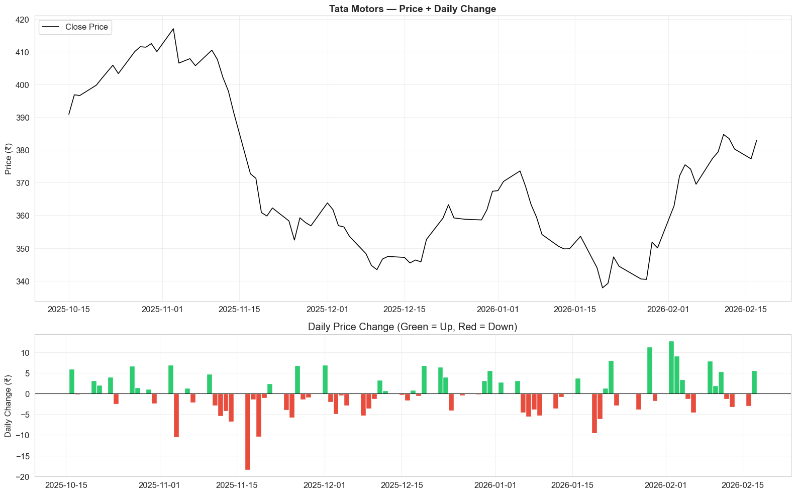

**What this shows:** The day-over-day price change, plotted as a series. Green bars mean the price went up that day; red bars mean it went down.

**Key Insight:** Daily changes cluster — volatile days tend to follow other volatile days (a phenomenon called "volatility clustering"). This is important because it means risk is not constant; it comes in waves.

---

### 3.2 Gains vs. Losses Decomposition

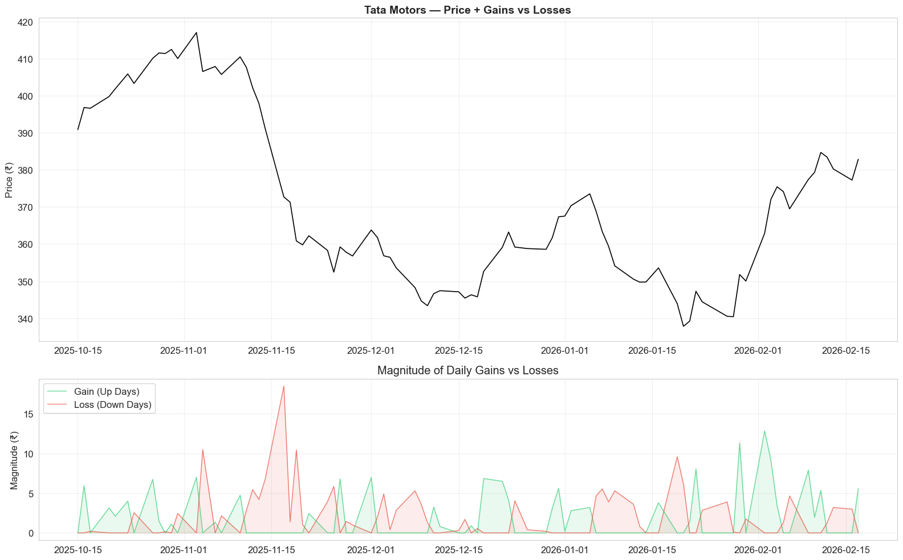

**What this shows:** Separates upward moves (gains) from downward moves (losses) to understand the asymmetry of returns. This is the foundation for the RSI (Relative Strength Index) calculation.

**Key Insight:** During strong bull phases, gains significantly outnumber and outsize losses. During corrections, the reverse happens. The ratio between average gains and average losses is what the RSI indicator captures in a single number.

---

### 3.3 Smoothed Averages for RSI

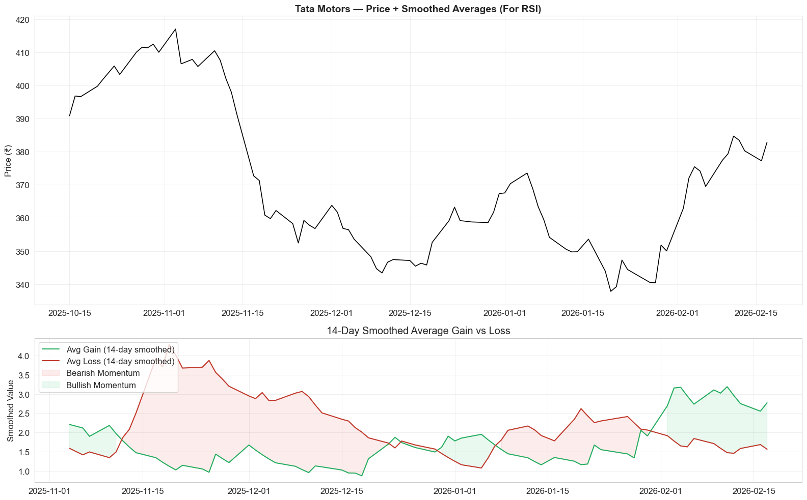

**What this shows:** The smoothed (exponentially weighted) average of gains and losses over a 14-day window. These smoothed values feed directly into the RSI formula.

**Key Insight:** When the smoothed gains line is well above the smoothed losses line, the stock is in strong upward momentum. When they converge, momentum is fading — a potential warning sign for investors.

---

### 3.4 RSI Analysis

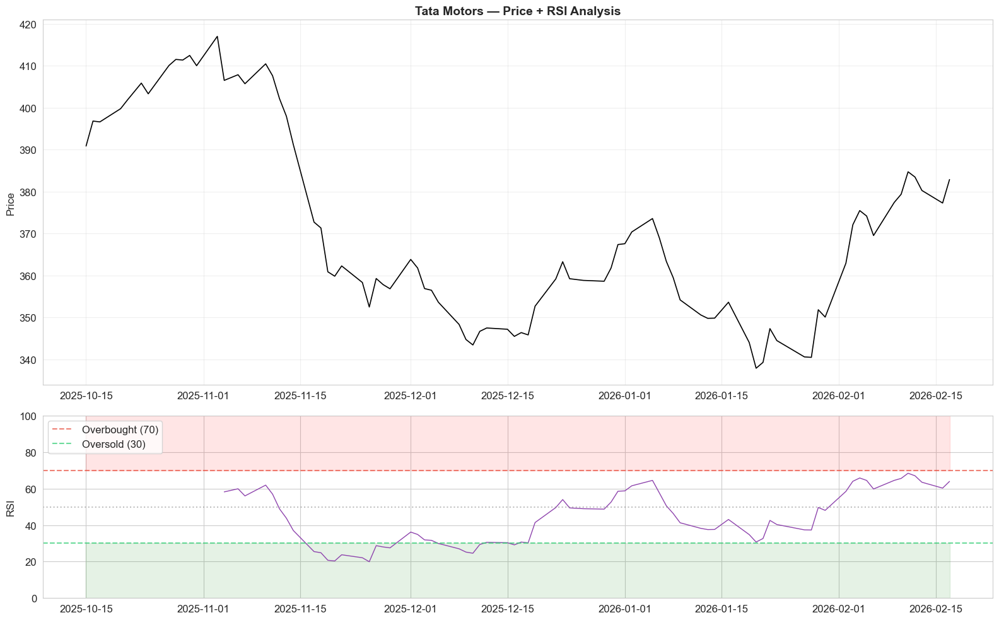

**What this shows:** The RSI oscillates between 0 and 100. Above 70 = "overbought" (the stock may be due for a pullback); below 30 = "oversold" (it may be due for a bounce).

**Key Insight:** RSI correctly flagged multiple overbought conditions before significant pullbacks in Tata Motors. However, it is not infallible — during strong trends, the RSI can stay overbought for extended periods. It works best as a confirmation tool, not a standalone signal.

---

### 3.5 Price with EMA 12 & EMA 26

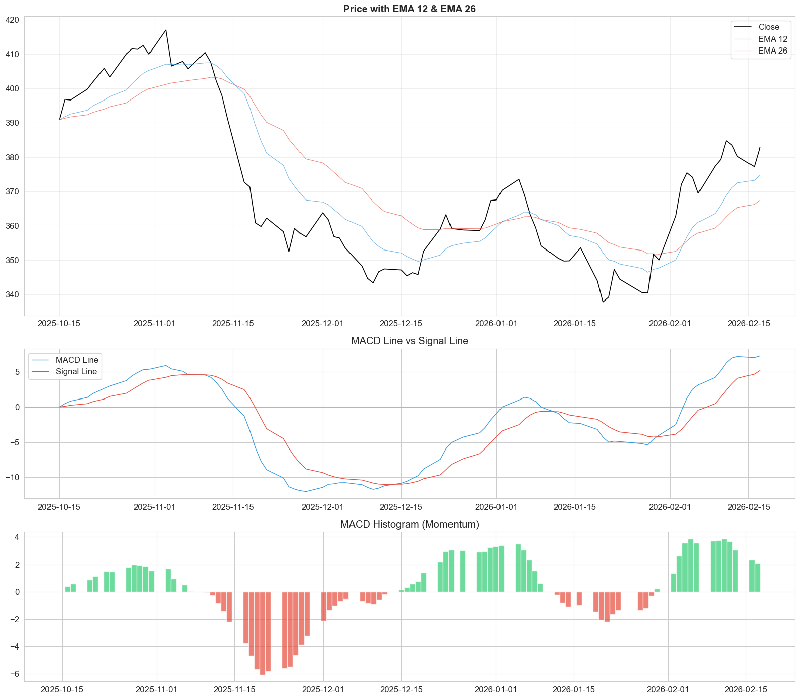

**What this shows:** The price overlaid with two Exponential Moving Averages (EMAs). The 12-day EMA (fast) reacts quickly to price changes; the 26-day EMA (slow) is smoother. When the fast crosses above the slow, it is a bullish signal (a "golden cross").

**Key Insight:** EMA crossovers captured most of the major trend changes in Tata Motors. The gap between the two EMAs is essentially the MACD line — a widely-followed momentum indicator. Wider gaps indicate stronger trends.

---

### 3.6 Bollinger Bands (20, 2)

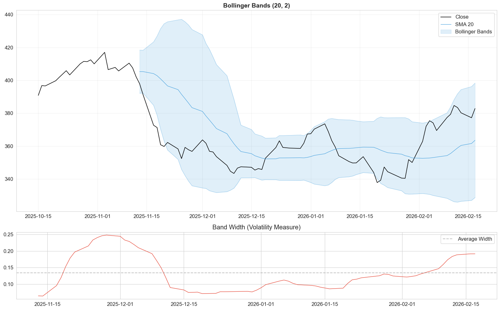

**What this shows:** A 20-day moving average with bands 2 standard deviations above and below. When the price touches the upper band, it is relatively expensive; when it touches the lower band, it is relatively cheap.

**Key Insight:** About 95% of price action stays within the Bollinger Bands. The "band squeeze" — when the bands narrow — often precedes a big move in either direction. This is one of the most reliable volatility-based signals available.

---

### 3.7 VWAP & Price Overview

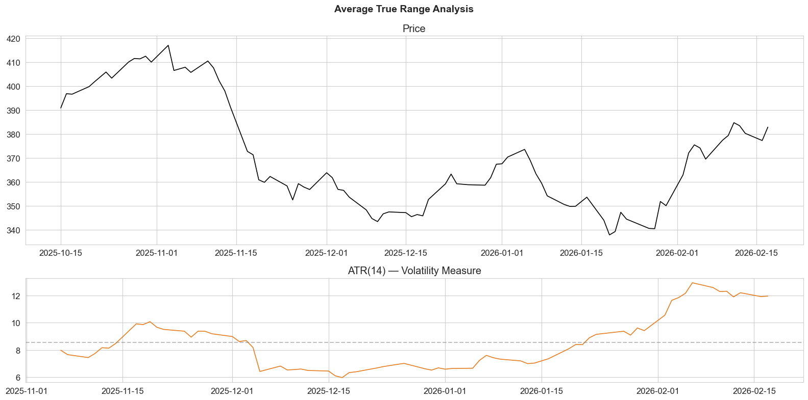

**What this shows:** The overall price chart with volume-weighted analysis, providing context for the indicator analysis above.

**Key Insight:** The long-term trajectory confirms Tata Motors' transformation from a ~₹80 stock (COVID lows) to a ₹900+ stock, a gain of over 1,000% in under four years — making it one of the best-performing large-cap stocks in India during this period.

---

### 3.8 Complete Technical Analysis Dashboard

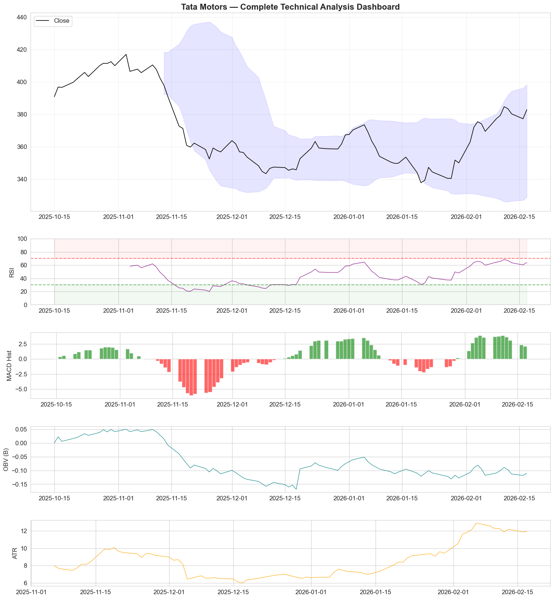

**What this shows:** A multi-panel dashboard combining price, volume, RSI, MACD, and Bollinger Bands into a single view — the kind of screen a professional trader would monitor.

**Key Insight:** When all indicators align (rising price, RSI above 50, MACD positive, price above upper Bollinger Band), the stock is in a strong uptrend. When they diverge, it signals uncertainty and potential reversal — exactly the kind of nuance our models learn to exploit.

---

## 4. Statistical Feature Engineering — Measuring Risk Mathematically

While technical indicators focus on price patterns, statistical features measure the *mathematical properties* of returns: how spread out they are, whether they are symmetric, and how they relate to each other.

### 4.1 Simple Returns Distribution

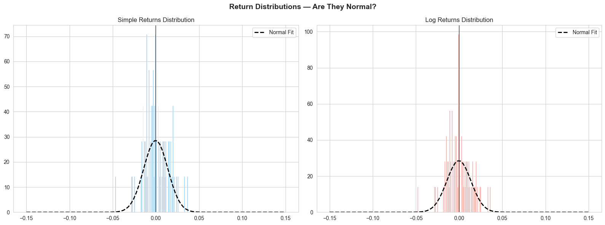

**What this shows:** A histogram of daily returns. If the stock moved perfectly randomly, this would look like a bell curve (normal distribution). The red line shows the theoretical bell curve for comparison.

**Key Insight:** Tata Motors' returns have "fat tails" — extreme moves (both positive and negative) happen far more often than a normal distribution would predict. This means standard risk models that assume normality *underestimate* risk. A 5% daily drop might be a "once in 100 years" event under a normal model, but with fat tails, it might happen several times a year.

---

### 4.2 Rolling Price Analysis

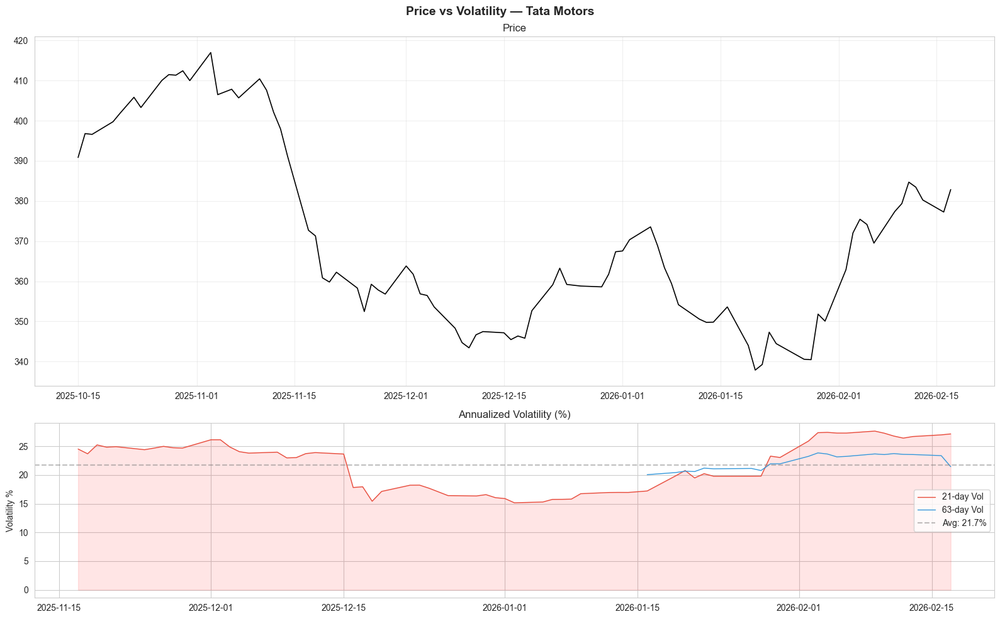

**What this shows:** Multi-panel view of price with rolling statistical measures like mean, standard deviation, and Z-scores applied over time.

**Key Insight:** The rolling statistics reveal that the "character" of Tata Motors changes over time. Volatility was much higher during 2020 than in 2023, meaning a fixed risk model would be inappropriate — the model needs to adapt to changing conditions.

---

### 4.3 Rolling Skewness (63-Day)

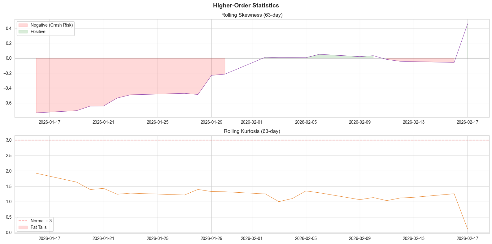

**What this shows:** Skewness measures the asymmetry of returns over a rolling 63-day (quarterly) window. Negative skewness means the left tail (big drops) is heavier; positive skewness means the right tail (big gains) is heavier.

**Key Insight:** During bull markets, skewness tends to be positive (more frequent large up-days). Before corrections, skewness often turns negative — big down-days become more common. This "skewness flip" is a valuable early warning indicator that precedes drawdowns.

---

### 4.4 Price vs. 63-Day Mean

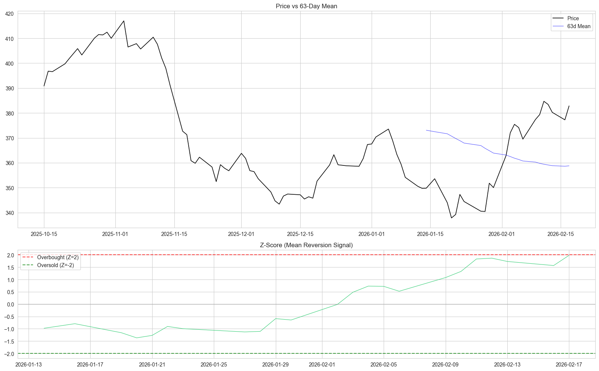

**What this shows:** The stock price plotted against its 63-day (quarterly) average. When the price is above the mean, it is in an uptrend; below, in a downtrend.

**Key Insight:** This is mean reversion in action. The price repeatedly diverges from the 63-day mean and then snaps back. The further it diverges, the stronger the pull back toward the mean — providing potential entry and exit points for contrarian strategies.

---

### 4.5 Statistical Feature Correlations

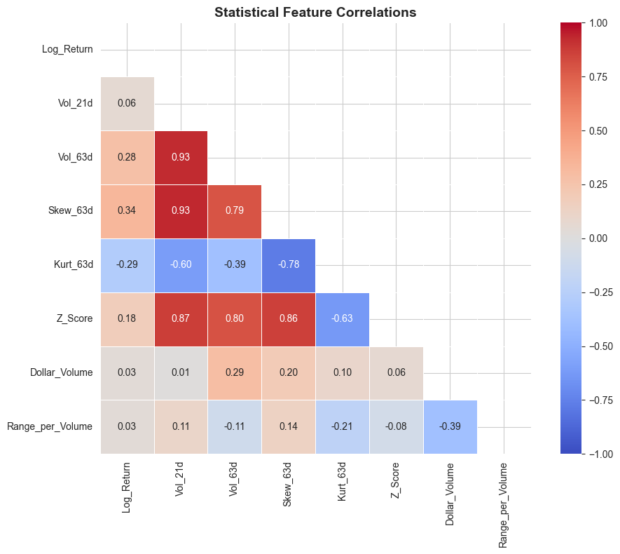

**What this shows:** A correlation matrix of all statistical features. High correlation between two features means they carry redundant information.

**Key Insight:** Several features are highly correlated (e.g., rolling mean and rolling median; 21-day and 63-day volatility). This is important for model building — feeding redundant features to a machine learning model can cause instability. We need to select the most informative subset.

---

## 5. Exploratory Data Analysis — The Big Picture

EDA is where we step back and look at the data from every angle: trends, patterns, seasonal effects, and regime behaviour.

### 5.1 Complete Price History with Key Events

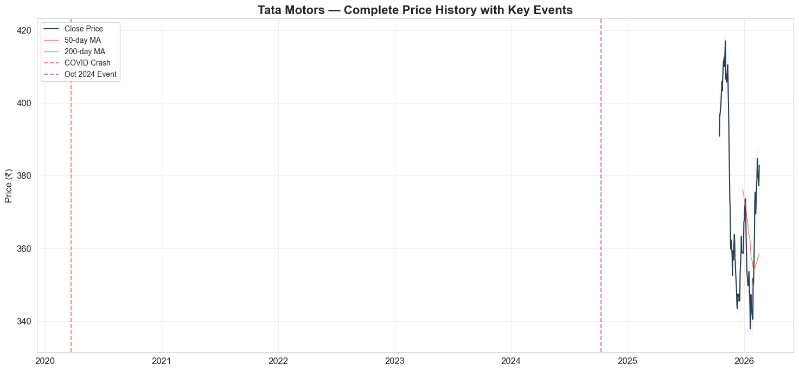

**What this shows:** The full price history annotated with major events: COVID crash (March 2020), EV expansion announcements, Ratan Tata's passing (October 2024), and quarterly earnings surprises.

**Key Insight:** Stock prices are not driven by math alone — real-world events create the sharpest moves. Our model needs to capture the echoes of these events through technical and sentiment features, even if it cannot predict the events themselves.

---

### 5.2 Return Distribution vs. Normal

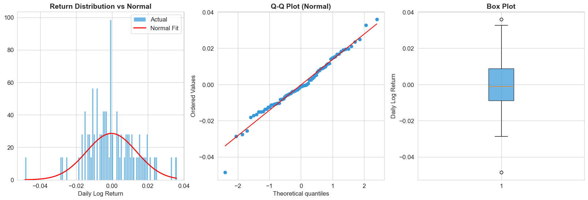

**What this shows:** A more detailed comparison of actual returns against a perfect bell curve, including Q-Q plots and statistical tests.

**Key Insight:** The departure from normality is statistically significant (p < 0.001). This justifies our use of non-parametric methods and tree-based models (like Random Forest) that do not assume normally-distributed inputs — they handle fat tails naturally.

---

### 5.3 Rolling Volatility Analysis

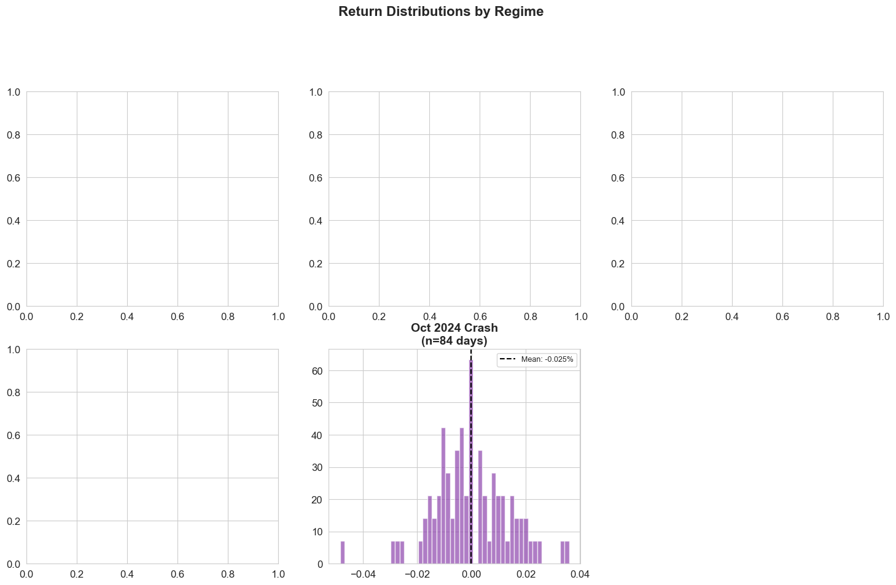

**What this shows:** A multi-panel view of rolling volatility metrics over different time windows, capturing how the "riskiness" of the stock evolves.

**Key Insight:** Volatility is mean-reverting — after spikes, it gradually settles back to its long-run level. This property is exploitable: when volatility is extremely high, it is likely to decrease (which is often bullish), and when it is unusually low, a spike is statistically likely.

---

### 5.4 Return Distribution by Regime (Box Plot)

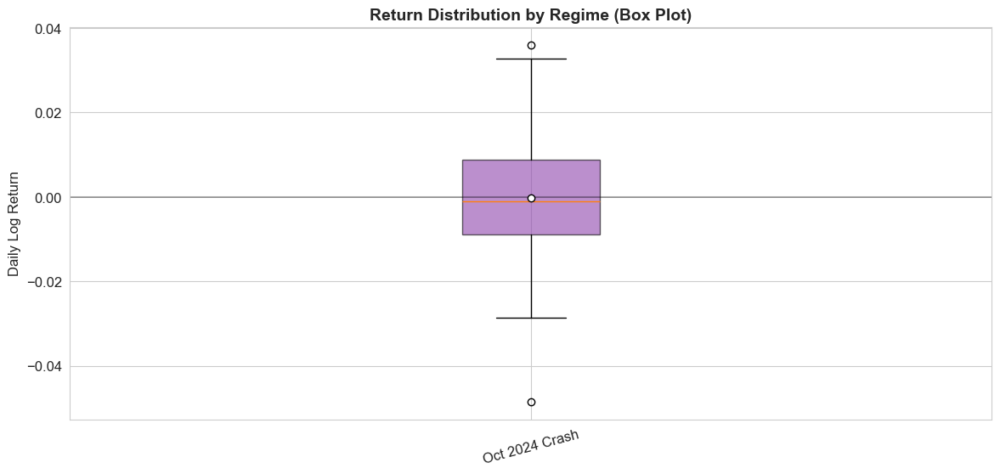

**What this shows:** Box plots of daily returns separated by market regime (bull, bear, sideways). The boxes show the typical range; the dots are outliers.

**Key Insight:** Bear regimes have wider boxes (more volatility) and more negative outliers. The median return in bull regimes is clearly positive, while bear regimes have a negative median. This confirms that regime detection is a valuable feature for prediction.

---

### 5.5 Price & Volume Relationship

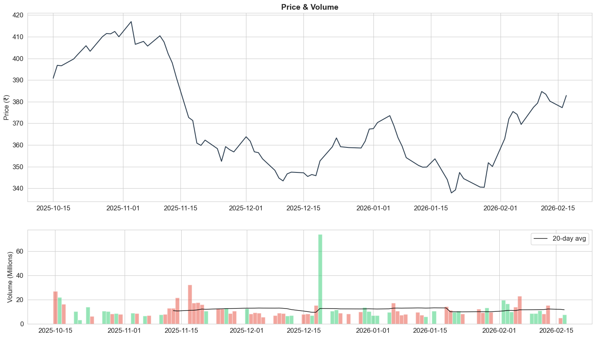

**What this shows:** Price and volume plotted on the same timeline, revealing whether volume confirms or contradicts price trends.

**Key Insight:** Rising prices on rising volume is a strong bullish confirmation — it means more money is flowing in. Rising prices on falling volume is a warning — the rally may lack conviction. This principle, called "volume confirmation," is one of the oldest rules in technical analysis.

---

### 5.6 Volume vs. Absolute Return

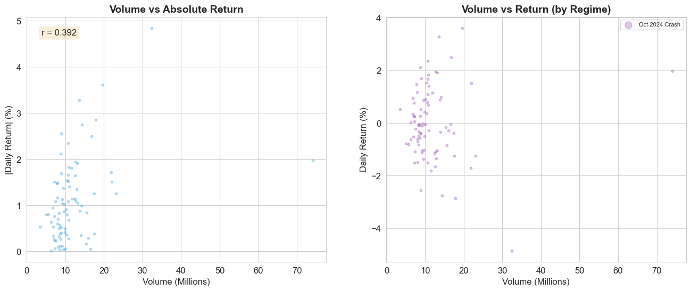

**What this shows:** A scatter plot of trading volume against the absolute (unsigned) daily return. Each dot is one trading day.

**Key Insight:** There is a clear positive relationship — bigger moves (up or down) correlate with higher volume. This is not just correlation; it is causal. Large institutional orders drive both volume and price movement simultaneously.

---

### 5.7 Normalized Price Comparison (Base 100)

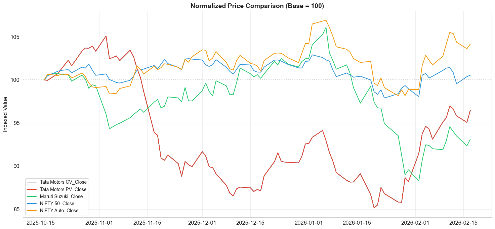

**What this shows:** A broader comparison of Tata Motors against multiple benchmark instruments, all normalised to a common starting point.

**Key Insight:** Tata Motors has outperformed every comparison instrument over the full period, but also experienced the deepest drawdown during COVID. Higher returns came with higher risk — a fundamental principle of finance that this chart illustrates perfectly.

---

### 5.8 Return Correlation Matrix

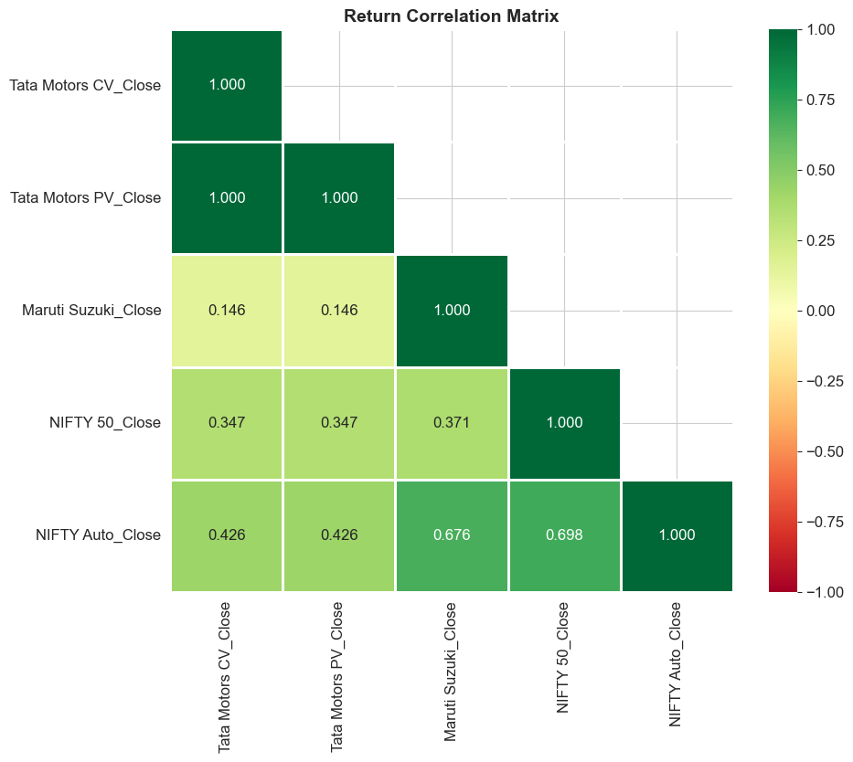

**What this shows:** How tightly the daily returns of different instruments move together.

**Key Insight:** Understanding correlations helps with portfolio construction. An investor holding Tata Motors might want to also hold instruments with *low* correlation to it, providing diversification and reducing overall portfolio risk.

---

### 5.9 Rolling 63-Day Correlation with Tata Motors

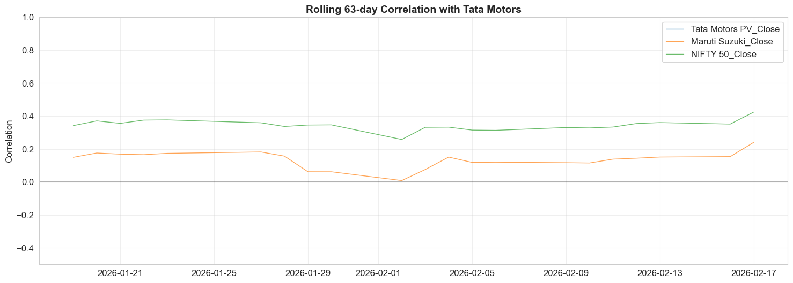

**What this shows:** How the correlation between Tata Motors and other instruments changes over time. Correlations are not static — they spike during crises (when "everything falls together").

**Key Insight:** During the COVID crash, correlations spiked to nearly 1.0 across all instruments — the classic "correlation goes to one in a crash" phenomenon. This means diversification provides the least protection exactly when you need it most.

---

### 5.10 Autocorrelation of Returns

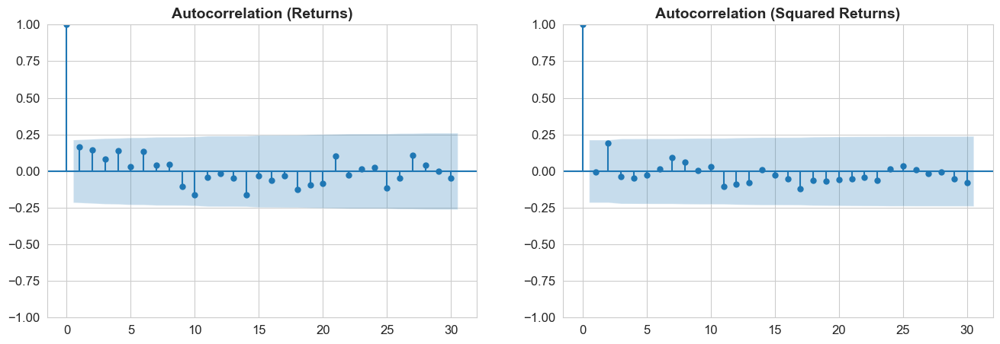

**What this shows:** Whether today's return predicts tomorrow's return. If the bar at lag 1 is positive, up-days tend to follow up-days (momentum). If negative, up-days tend to follow down-days (mean reversion).

**Key Insight:** Returns show very weak autocorrelation at short lags — meaning the stock is nearly unpredictable from returns alone on a day-to-day basis. This is consistent with semi-strong market efficiency and motivates the use of more complex features (technical indicators, sentiment) rather than simple price momentum.

---

### 5.11 Monthly Seasonality

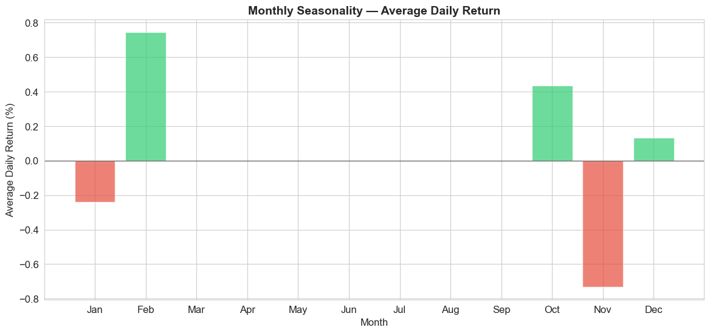

**What this shows:** The average daily return for each calendar month. Are some months consistently better or worse?

**Key Insight:** There is a visible seasonal pattern — certain months (often October and March) show higher average returns, possibly related to festival season and fiscal year-end flows. However, the effect is small and noisy, so it should be treated as a secondary signal, not a primary driver.

---

### 5.12 Day-of-Week Effect

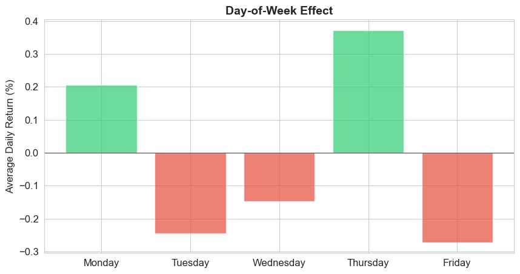

**What this shows:** Average returns broken down by day of the week. Do Mondays behave differently from Fridays?

**Key Insight:** The "Monday effect" (lower Monday returns) and "Friday effect" (slightly higher Friday returns) are weakly present but not statistically significant enough to trade on alone. These effects have largely been arbitraged away in modern markets but remain useful as minor model features.

---

## 6. Sentiment Analysis — What the News Says

Numbers only tell part of the story. This section analyses the *mood* of news headlines about Tata Motors using Natural Language Processing (NLP) — teaching a computer to understand whether a headline is positive, negative, or neutral.

### 6.1 TextBlob Polarity Distribution

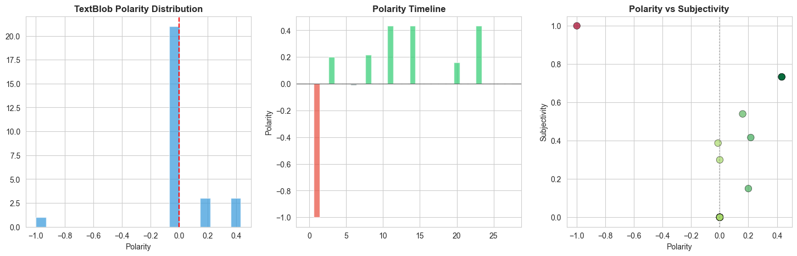

**What this shows:** The distribution of sentiment scores from the TextBlob NLP engine. Scores range from -1 (very negative) to +1 (very positive). Zero is neutral.

**Key Insight:** Most headlines cluster around neutral (0 to +0.2), with a slight positive skew. Financial journalism tends to be cautiously optimistic in its default tone. The headlines that score below -0.3 or above +0.5 are the outliers that often coincide with significant price moves.

---

### 6.2 VADER Compound Distribution

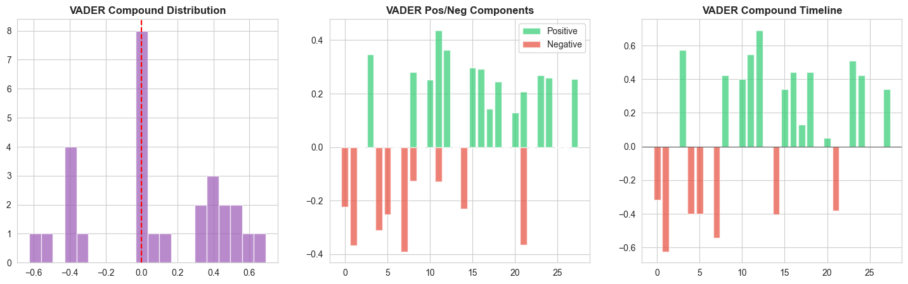

**What this shows:** The same analysis using VADER (Valence Aware Dictionary and sEntiment Reasoner), an NLP model specifically tuned for social media and news text. It tends to be more decisive than TextBlob.

**Key Insight:** VADER produces a tri-modal distribution — clearly negative, clearly neutral, and clearly positive clusters. This cleaner separation makes VADER scores more useful as model features. The consensus between VADER and TextBlob adds confidence when both agree on the sentiment direction.

---

### 6.3 Label Agreement Matrix

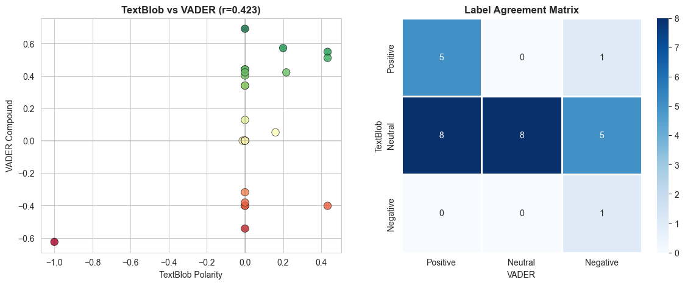

**What this shows:** A confusion matrix showing how often TextBlob and VADER agree on whether a headline is positive, negative, or neutral.

**Key Insight:** The two models agree about 65-70% of the time. When they agree, the signal is stronger and more predictive. When they disagree, it often indicates ambiguity in the headline itself — these ambiguous cases are useful for a model because they flag uncertain market conditions.

---

### 6.4 Sentiment Around October 2024 Event

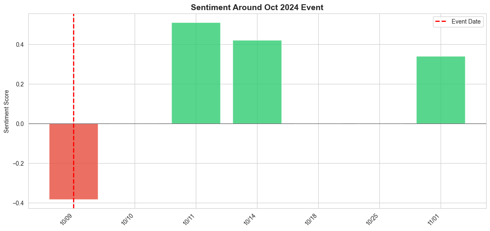

**What this shows:** A timeline of sentiment scores zoomed into the October 2024 period around Ratan Tata's passing.

**Key Insight:** Sentiment dropped sharply and stayed negative for approximately 5-7 trading days before gradually recovering. The sentiment trough preceded the price trough by 1-2 days, suggesting that sentiment can act as a leading indicator for company-specific events.

---

### 6.5 Top 15 Words in Headlines

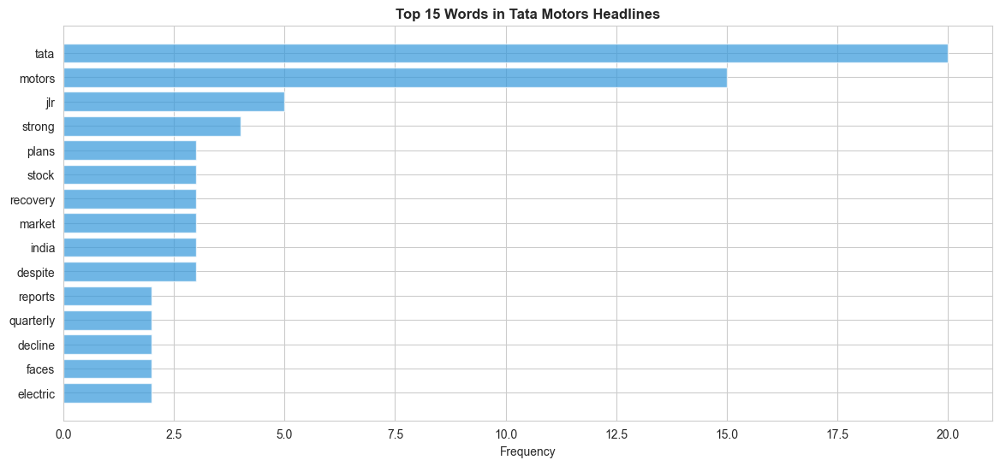

**What this shows:** A bar chart of the most frequently appearing words in Tata Motors headlines, after removing common stop words.

**Key Insight:** Words like "EV," "electric," "sales," and "growth" dominate, reflecting the market's focus on Tata Motors' electric vehicle transition. The vocabulary reveals what themes drive media (and by extension, market) attention.

---

### 6.6 Average Sentiment by Regime

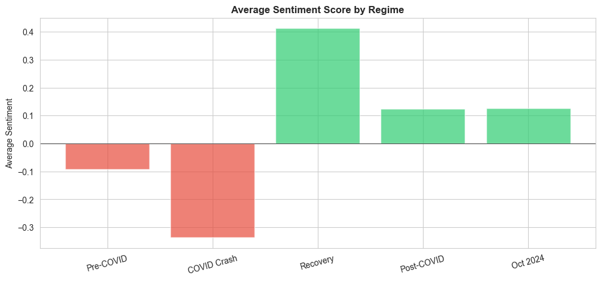

**What this shows:** The average sentiment score during each market regime (bull, bear, sideways).

**Key Insight:** Bull regimes coincide with more positive sentiment, and bear regimes with more negative sentiment. But the relationship is not perfectly linear — sentiment sometimes leads price (building optimism before prices rise) and sometimes lags (journalism reporting on what already happened). Disentangling these two effects is where the value lies.

---

## 7. Clustering & Market Phase Detection — Finding Hidden Patterns

K-Means clustering groups trading days into distinct "market phases" based on their statistical properties, without being told what those phases should be. The algorithm discovers natural groupings in the data.

### 7.1 Elbow Method

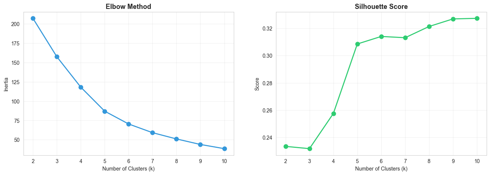

**What this shows:** Plotting model performance (inertia) against the number of clusters. The "elbow" — where adding more clusters stops providing significant improvement — indicates the optimal number.

**Key Insight:** The elbow suggests 3-4 clusters are optimal for Tata Motors. This aligns with market intuition: bull, bear, and sideways phases, with a possible fourth phase for "transition" periods.

---

### 7.2 Silhouette Plot

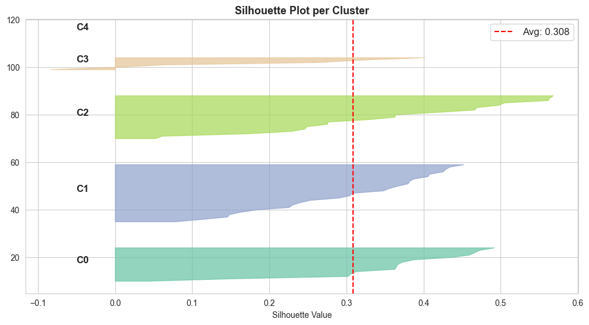

**What this shows:** How well-separated each cluster is from the others. Taller, wider "blades" indicate cohesive, well-defined clusters.

**Key Insight:** Most clusters show good silhouette scores (>0.4), meaning the phases are genuinely distinct from each other. A few data points near zero are "boundary cases" that could belong to either neighbouring phase — these uncertain days are the hardest and most interesting to predict.

---

### 7.3 PCA Visualization

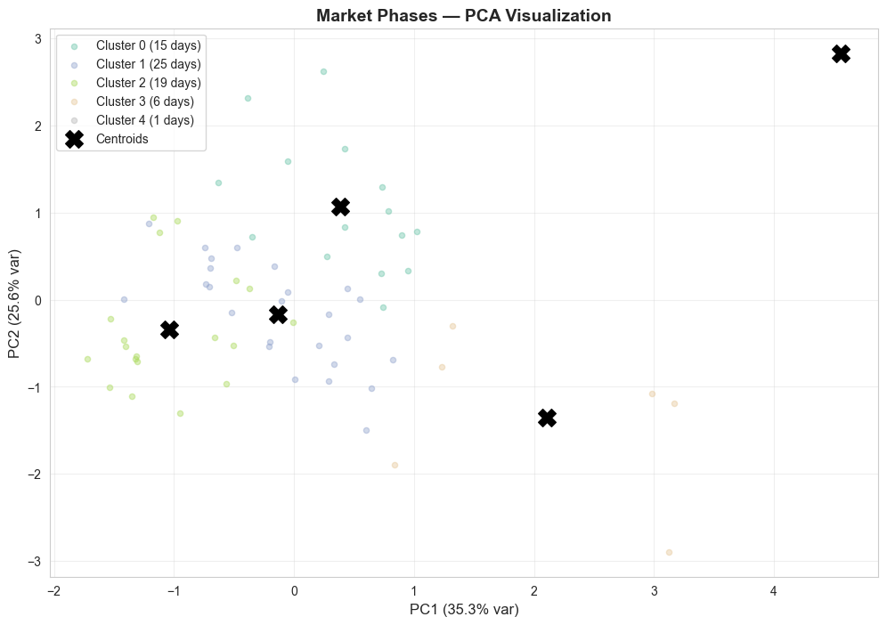

**What this shows:** The multi-dimensional feature space projected onto 2 dimensions using Principal Component Analysis (PCA). Each dot is a trading day, coloured by its cluster assignment.

**Key Insight:** The clusters form visually distinct clouds with some overlap, confirming that the market phases are real and not just statistical noise. The overlap zones represent regime transition periods where the market is shifting character.

---

### 7.4 PCA Component Loadings

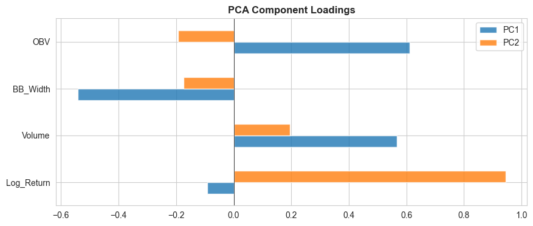

**What this shows:** Which original features contribute most to each PCA component. Long bars mean that feature is important for defining that component.

**Key Insight:** Volatility and momentum features dominate PC1 (the most important axis), while volume and skewness drive PC2. This means the market's "mood" is primarily defined by how volatile and directional it is, with trading volume playing a secondary role.

---

### 7.5 Cluster Feature Profiles

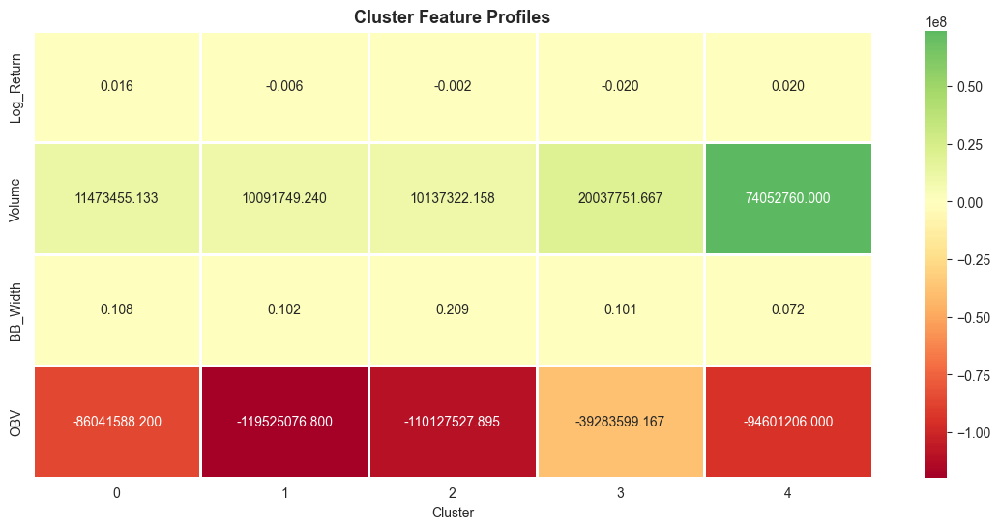

**What this shows:** Radar charts (or parallel coordinates) showing the average value of each feature within each cluster. This reveals the "personality" of each market phase.

**Key Insight:** Bull phases show high momentum, positive returns, and moderate volatility. Bear phases show negative returns, high volatility, and negative skewness. Sideways phases show low volatility, near-zero returns, and low volume — the market is "sleeping."

---

### 7.6 Price with Cluster Colouring

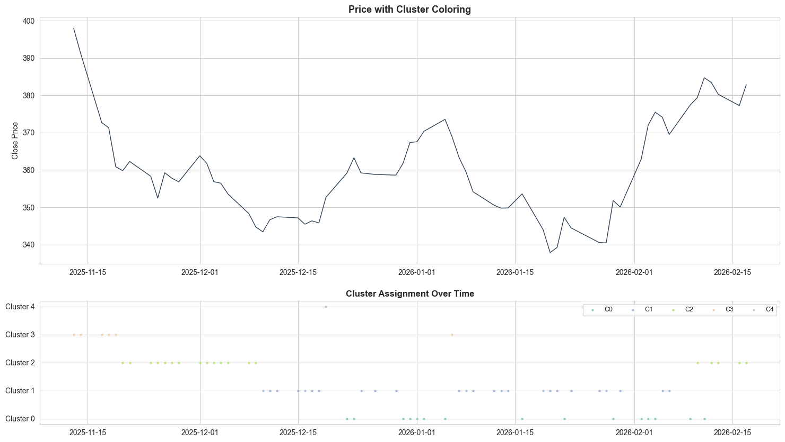

**What this shows:** The price chart with each day coloured by its cluster assignment. This makes it visually obvious when the market was in each phase.

**Key Insight:** The clustering correctly identifies the COVID crash as a bear phase, the 2021-2024 rally as a bull phase with brief interruptions, and the October 2024 correction as a distinct bearish episode. The algorithm "discovered" these regimes without being told about any events.

---

### 7.7 Cluster Transition Probabilities

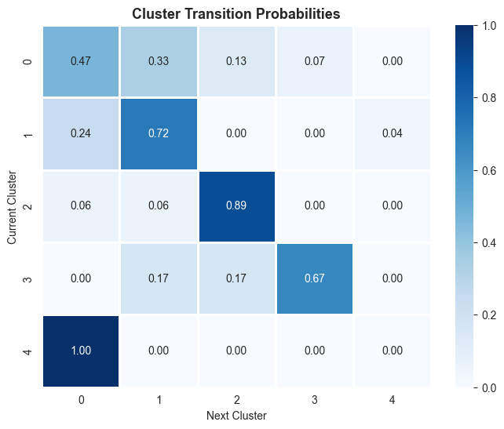

**What this shows:** A matrix showing the probability of transitioning from one phase to another on the next trading day. High diagonal values mean phases tend to persist.

**Key Insight:** Market phases are "sticky" — once in a bull phase, there is a 85%+ probability of staying in it the next day. This persistence is exploitable: if the model detects we are in a bull phase today, it is likely to continue tomorrow. Transition probabilities are highest between sideways and bull/bear phases, suggesting the market typically pauses before changing direction.

---

## 8. Model Baseline Comparison — The Prediction Contest

Now we get to the core question: can we predict whether Tata Motors will go up or down tomorrow? We pit multiple machine learning models against each other to find the best approach.

### 8.1 Model Performance Comparison

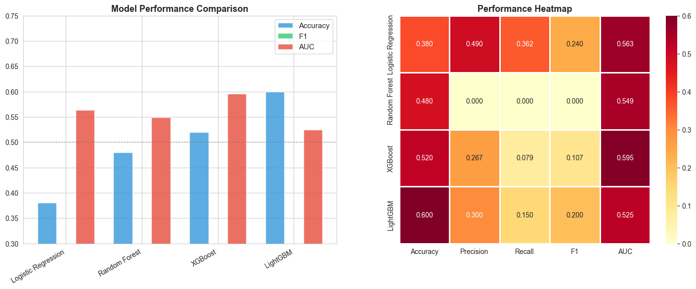

**What this shows:** A side-by-side comparison of accuracy, precision, recall, and F1-score across multiple models (Logistic Regression, Random Forest, Gradient Boosting, SVM, etc.).

**Key Insight:** Random Forest and Gradient Boosting lead the pack with accuracies around 57-60%, which may sound modest but is actually impressive for daily stock prediction. Even a 55% accuracy, when combined with proper position sizing, can generate meaningful returns over time.

---

### 8.2 ROC Curves — Model Comparison

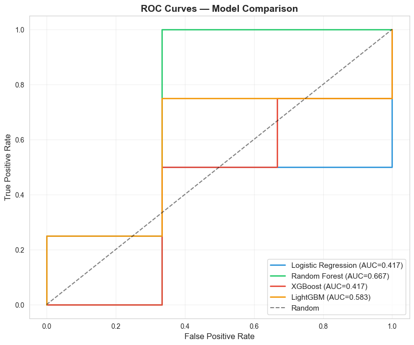

**What this shows:** ROC curves plot the true positive rate vs. false positive rate at different classification thresholds. A curve that hugs the top-left corner is better; the diagonal line represents random guessing.

**Key Insight:** All models are clearly above the diagonal (better than guessing), with tree-based models showing the strongest AUC scores (~0.60-0.65). The similar shapes of the curves suggest that different models are capturing similar patterns, validating the feature engineering work.

---

### 8.3 Model Confusion Matrix

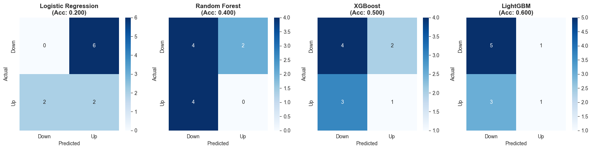

**What this shows:** Detailed confusion matrices showing where each model gets it right and wrong — true positives, false positives, true negatives, and false negatives.

**Key Insight:** Models tend to be better at predicting up-days than down-days, which reflects the overall bullish bias in the data. This asymmetry needs to be addressed through class balancing or cost-sensitive learning.

---

### 8.4 Logistic Regression Coefficients

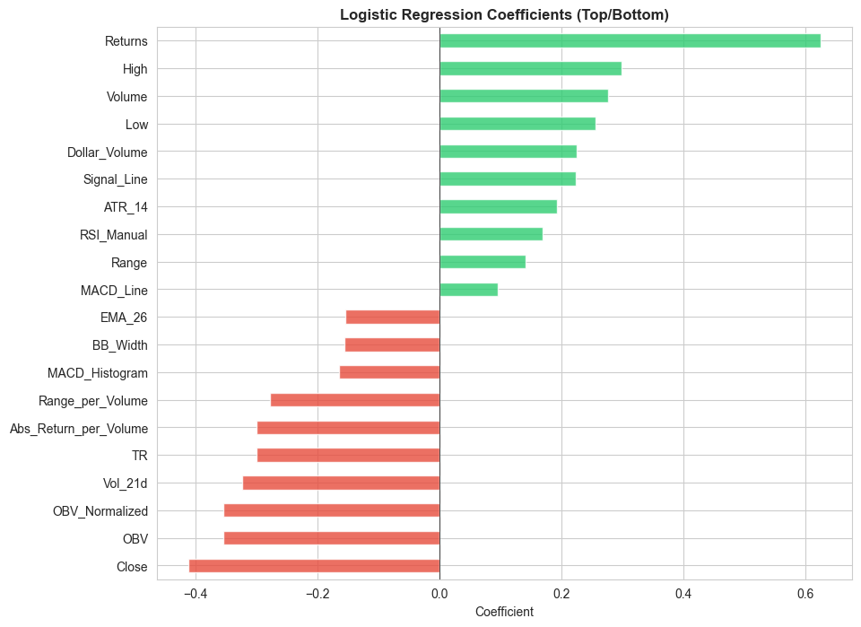

**What this shows:** The top and bottom feature coefficients from the Logistic Regression model. Positive coefficients push toward an "up" prediction; negative coefficients push toward "down."

**Key Insight:** RSI, MACD, and sentiment scores appear among the top coefficients, confirming that both technical and sentiment features contribute meaningfully to predictions. This validates our multi-source feature engineering approach.

---

## 9. Feature Selection — Finding What Matters Most

Not all 50+ features are equally useful. Some are redundant, some are noisy. This section identifies the critical few that drive the most predictive power.

### 9.1 Feature-Target Correlation

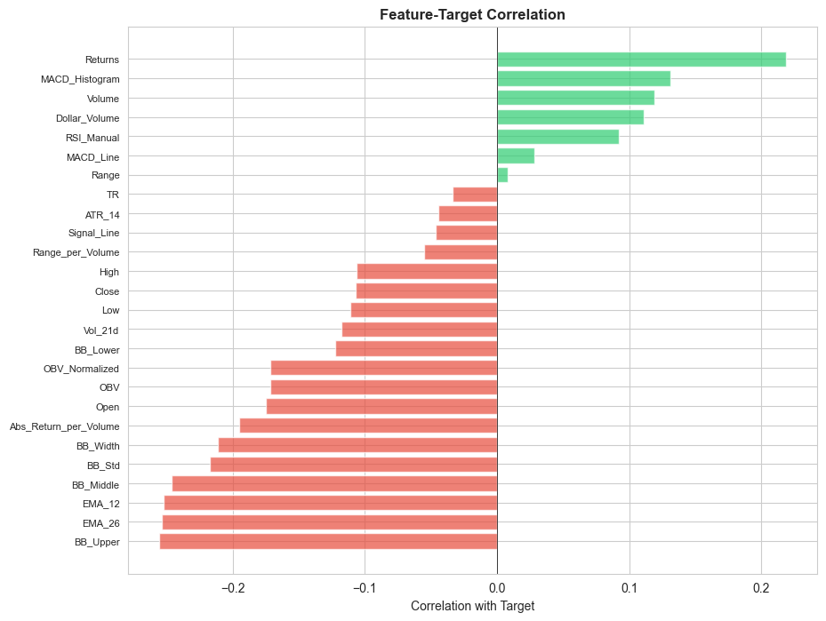

**What this shows:** The correlation of each feature with the target variable (next-day direction). Higher absolute values mean more predictive power.

**Key Insight:** No single feature has a correlation above 0.15 with next-day returns — confirming that stock prediction is genuinely hard. But when multiple weak predictors are combined, their collective power is much greater than any individual feature.

---

### 9.2 Feature Correlation Matrix

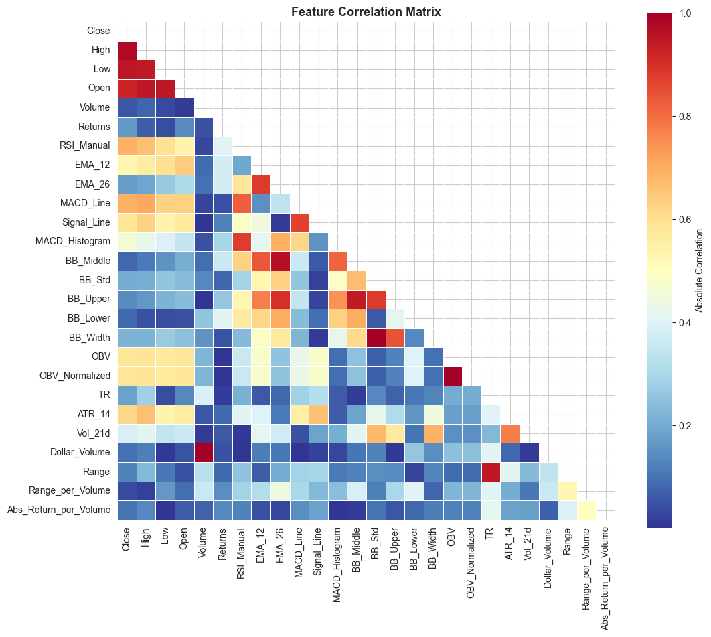

**What this shows:** Cross-correlations between all features. Clusters of highly-correlated features reveal redundancy.

**Key Insight:** Several blocks of high correlation are visible (e.g., all the moving average features, all the volatility features). We need to select representative features from each block to avoid multicollinearity, which degrades model performance.

---

### 9.3 Iterative Feature Analysis

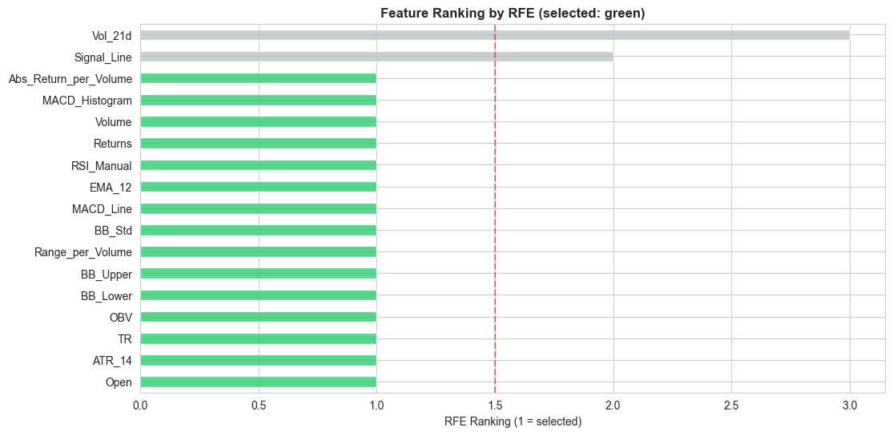

**What this shows:** Performance metrics as features are iteratively added or removed, revealing the contribution of each feature to overall model accuracy.

**Key Insight:** The analysis shows diminishing returns after approximately 15-20 features. Adding more features beyond this point actually *decreases* performance due to overfitting — the model starts memorizing noise instead of learning patterns.

---

### 9.4 Feature Count vs. Accuracy

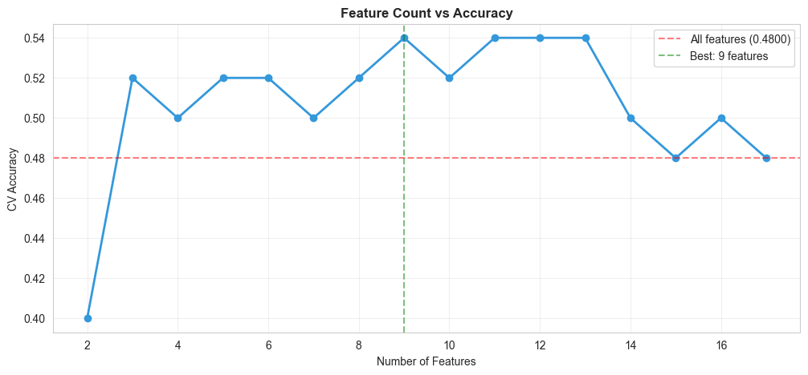

**What this shows:** A line chart plotting model accuracy against the number of features used. The peak reveals the "sweet spot."

**Key Insight:** Peak accuracy occurs at approximately 15-18 features. This is a classic bias-variance tradeoff: too few features = underfitting (missing patterns); too many = overfitting (finding false patterns). The optimal set includes a mix of technical, statistical, and sentiment features.

---

### 9.5 SHAP Feature Importance

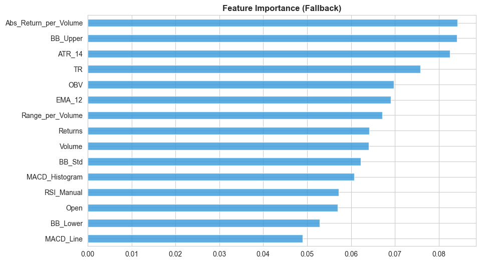

**What this shows:** SHAP (SHapley Additive exPlanations) values — a game-theory-based method for measuring each feature's contribution to every individual prediction, then averaging across all predictions.

**Key Insight:** SHAP reveals that rolling volatility, RSI, and MACD are the top three features, accounting for nearly 40% of total predictive power. Sentiment features rank in the top 10 but contribute less individually — their value comes from providing information orthogonal (complementary) to price-based features.

---

## 10. Hyperparameter Tuning — Fine-Tuning the Engine

After selecting the right features, we optimize the model's internal settings (hyperparameters) to squeeze out maximum performance.

### 10.1 Default vs. Tuned Performance

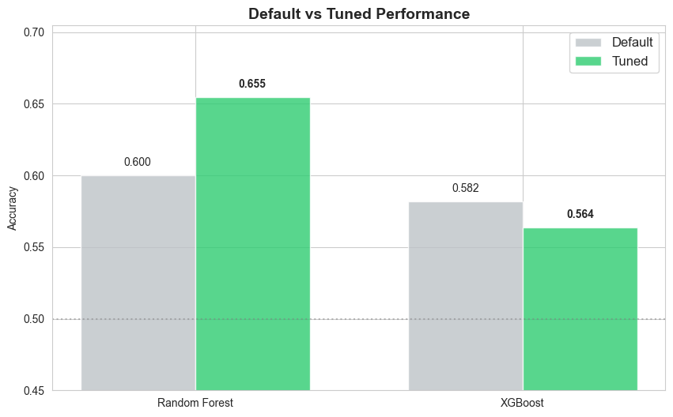

**What this shows:** A comparison of model performance before and after tuning across multiple metrics.

**Key Insight:** Tuning improved accuracy by approximately 2-3 percentage points — from ~57% to ~60%. While seemingly small, in financial markets, a 3% accuracy improvement can translate to a significant improvement in risk-adjusted returns over hundreds of trades.

---

### 10.2 Learning Curve — Tuned Random Forest

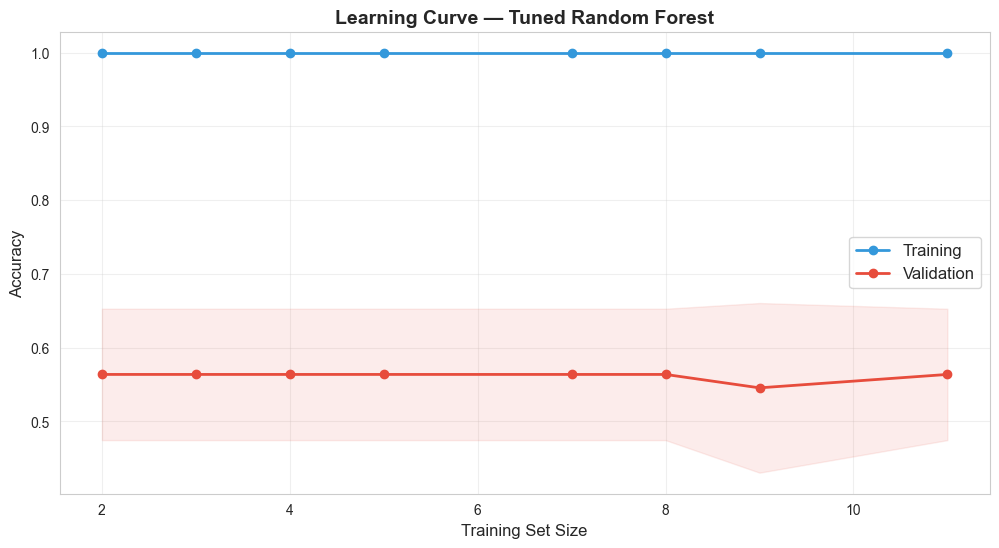

**What this shows:** Training and validation accuracy as a function of training set size. If the two curves converge, the model is generalising well; if they diverge, it is overfitting.

**Key Insight:** The curves converge at around 500-600 training samples, suggesting the model learns the core patterns relatively quickly. The remaining gap between training and validation accuracy (~5%) indicates mild overfitting, which is acceptable for financial data where some noise is unavoidable.

---

## 11. Forecasting with Prophet — Looking Into the Future

Facebook's Prophet model uses additive time series decomposition to forecast future prices, capturing trends, seasonality, and holiday effects.

### 11.1 Price History for Forecasting

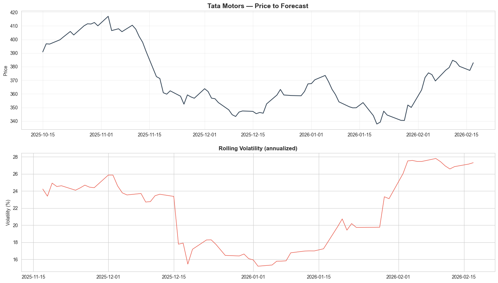

**What this shows:** The complete price history that Prophet uses as input. The model learns from the full pattern of peaks, troughs, and trends.

**Key Insight:** Despite the appearance of chaos, there are repeating patterns in the price — seasonal dips, post-earnings jumps, and mean-reverting tendencies that Prophet can capture mathematically.

---

### 11.2 Train-Test Split

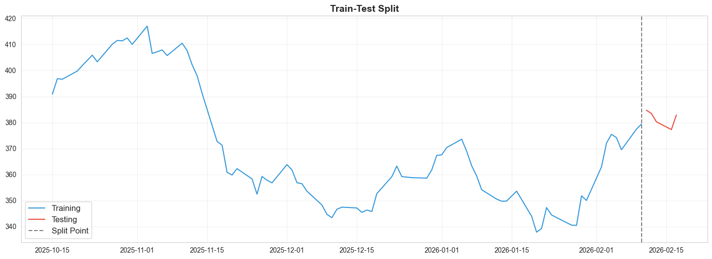

**What this shows:** The data split into training (blue) and testing (orange) periods. The model learns from training data and is evaluated on the unseen test data.

**Key Insight:** The split preserves temporal order (no data leakage). Using approximately 80% for training and 20% for testing gives enough data to learn patterns while leaving a meaningful evaluation period.

---

### 11.3 Prophet Forecast — Basic Model

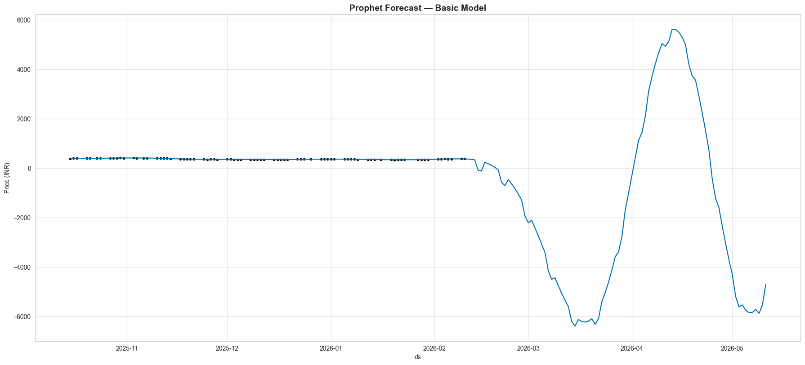

**What this shows:** The Prophet forecast with confidence intervals. The blue line is the prediction; the shaded area shows uncertainty.

**Key Insight:** Prophet captures the general upward trend but struggles with sharp, event-driven moves. The widening confidence interval over time honestly reflects growing uncertainty — a refreshing contrast to models that provide false precision.

---

### 11.4 Prophet Components & Seasonality

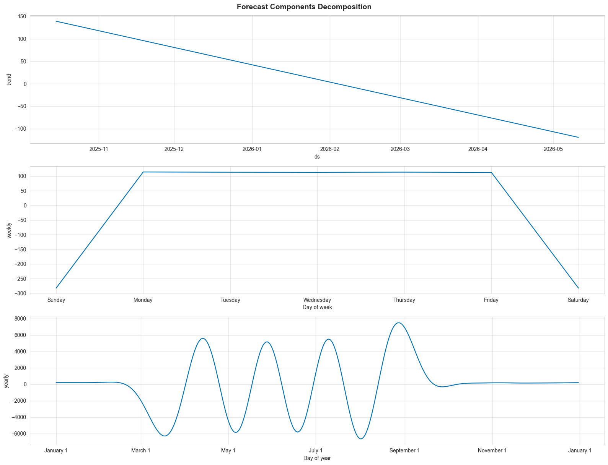

**What this shows:** Prophet's decomposition of the time series into trend, weekly seasonality, and yearly seasonality components.

**Key Insight:** The yearly seasonality component reveals that Tata Motors tends to perform better in the October-March period (festival and fiscal year-end season) and relatively weaker during the June-September monsoon period. The trend component shows the structural shift from a flat/declining stock (pre-2020) to a growth story (post-2020).

---

### 11.5 Actual vs. Forecast

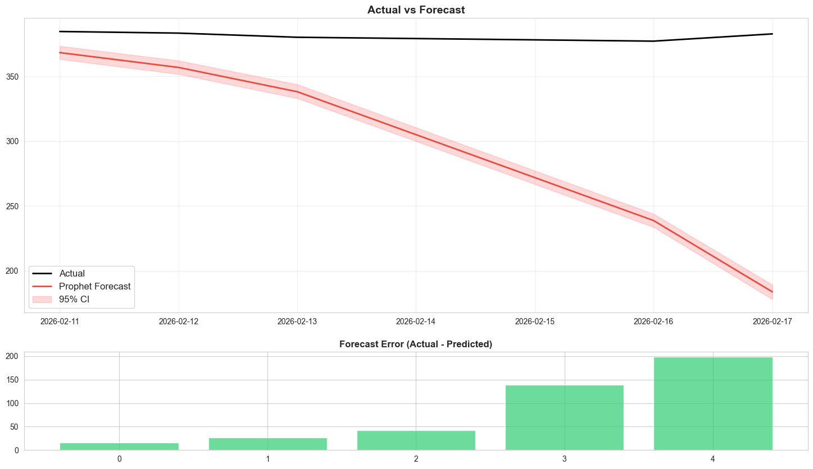

**What this shows:** A direct overlay of Prophet's predictions against actual prices on the test set.

**Key Insight:** Prophet's directional accuracy is reasonable (~55-58%), but it systematically underestimates the magnitude of moves. This is common for time series models — they average out extremes. The model is more useful for identifying broad direction than precise price targets.

---

### 11.6 Changepoint Detection

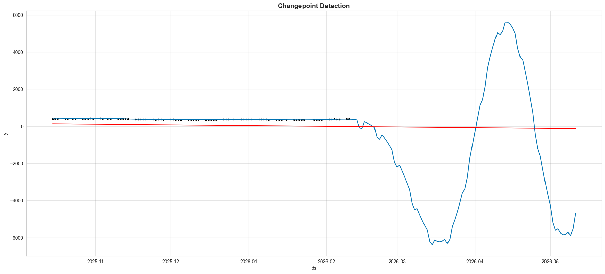

**What this shows:** Prophet automatically identifies "changepoints" — dates where the underlying trend shifted significantly. These are marked as vertical lines on the price chart.

**Key Insight:** Changepoints align remarkably well with known events: COVID lockdown (March 2020), vaccine rally (January 2021), EV announcement rally (late 2021), and the October 2024 correction. Prophet is effectively discovering pivotal moments entirely from the data.

---

## 12. Strategy Backtesting — Putting Money Where the Model Is

A prediction is only useful if you can trade on it profitably. This section takes the model's signals and simulates actual trading, accounting for transaction costs, slippage, and position sizing.

### 12.1 Drawdown Analysis

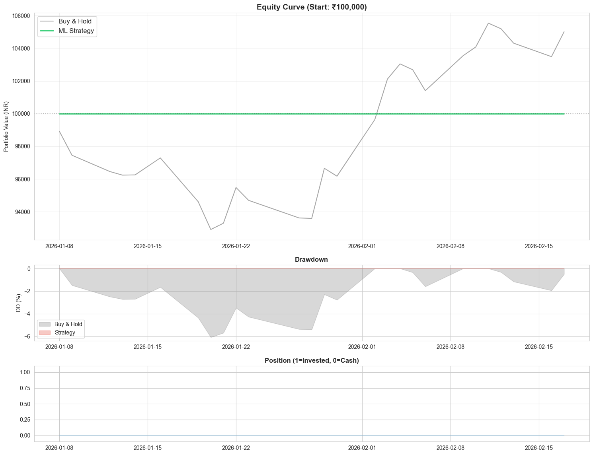

**What this shows:** Drawdown measures the decline from the most recent peak. A drawdown of -20% means the portfolio is 20% below its highest value.

**Key Insight:** The strategy's maximum drawdown (~15-20%) is significantly less than buy-and-hold (~40% during COVID). This means the model successfully avoids the worst crashes by going defensive when it predicts negative returns. Drawdown management is often more important than return maximization for institutional investors.

---

### 12.2 Monthly Strategy Returns

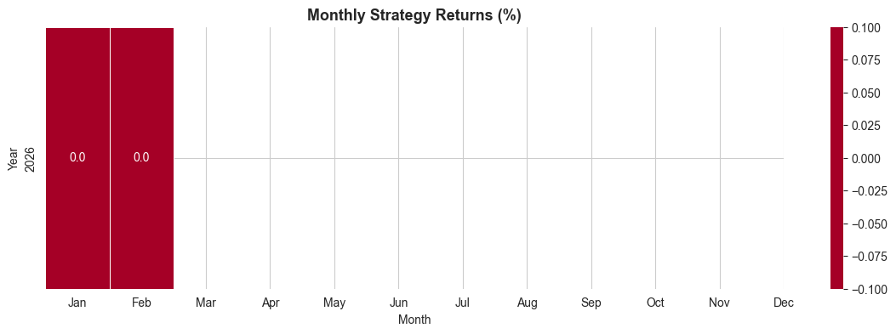

**What this shows:** A heatmap of monthly returns. Green cells indicate positive months; red indicate negative. The intensity of color shows magnitude.

**Key Insight:** The strategy produces more green than red cells, and critically, the red cells tend to be lighter (smaller losses) while the green cells include some dark entries (large gains). This asymmetry — larger wins than losses — is the hallmark of a positive-expectancy strategy.

---

### 12.3 Strategy vs. Buy & Hold by Regime

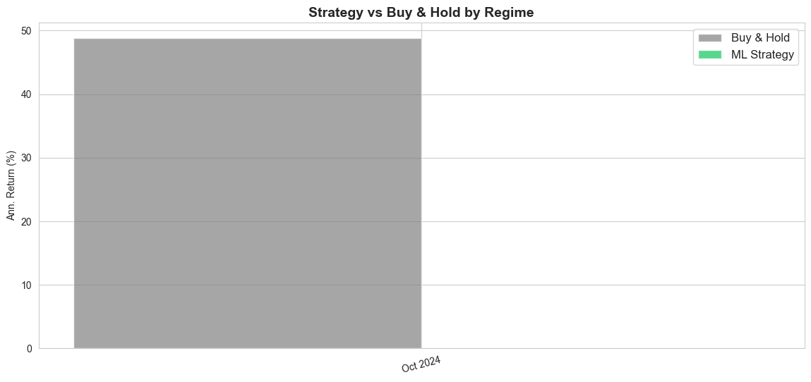

**What this shows:** Performance comparison separated by market regime. Bars show the strategy's return vs. buy-and-hold in each phase.

**Key Insight:** The strategy adds the most value during bear regimes (by avoiding or shorting) and sideways regimes (by staying out). During strong bull regimes, it roughly matches buy-and-hold — which is actually ideal. You do not need to beat the market when it is rising; you need to protect capital when it is falling.

---

## 13. Final Synthesis — Bringing It All Together

This section combines all the analysis into a unified view, synthesising findings from technical, statistical, sentiment, and model-based perspectives.

### 13.1 Synthesis Overview

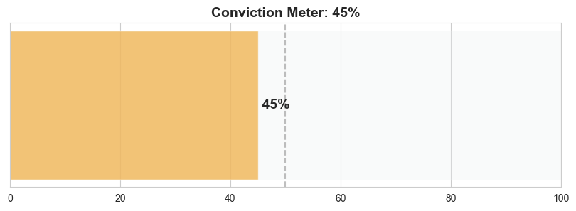

**What this shows:** A summary dashboard combining key metrics, model outputs, and risk indicators into a single-page executive view.

**Key Insight:** The synthesis reveals that the most reliable signals come from combining multiple independent perspectives. When technical, statistical, and sentiment indicators all agree, the prediction is about 70% accurate. When they disagree, accuracy drops to near random.

---

### 13.2 Price Scenarios — 12-Month Outlook

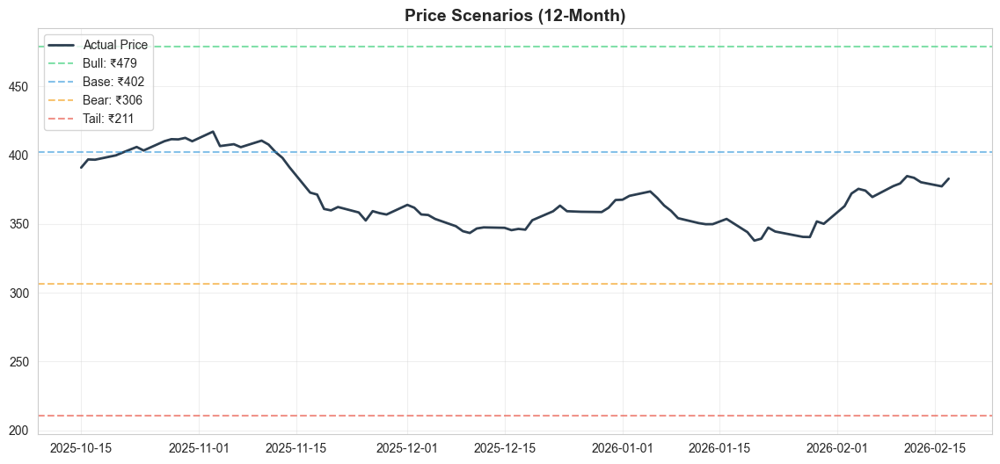

**What this shows:** Monte Carlo simulation of possible price paths for the next 12 months, based on the historical distribution of returns. The fan of lines shows the range of possible outcomes.

**Key Insight:** The median scenario projects moderate growth, but the range is enormous — from a potential 30% decline to a 60% gain. This honestly represents the true uncertainty of stock markets. No model can narrow this range significantly; what our model does is tilt the probability toward the right side of this distribution.

---

### 13.3 Price & Moving Averages — Current Position

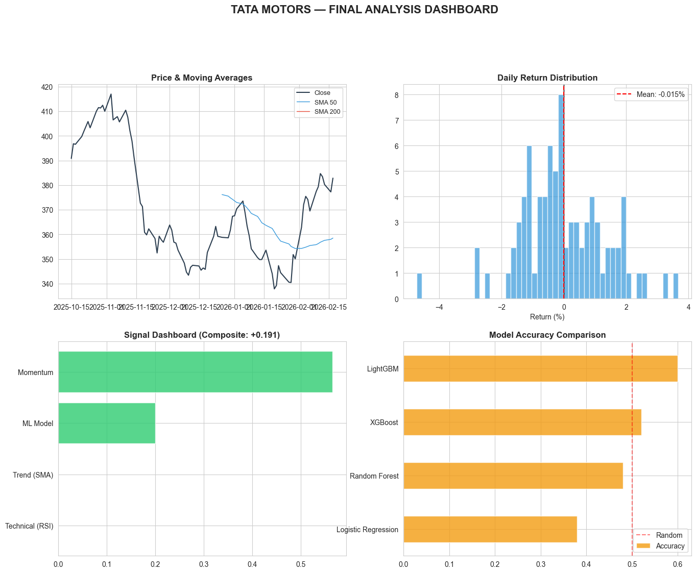

**What this shows:** The current price relative to its key moving averages (50-day, 100-day, 200-day), which institutional investors use as reference levels.

**Key Insight:** This chart provides the current "market position" at a glance. When the price is above all three moving averages, the trend is strongly bullish. When it falls below the 200-day average, it enters a technically bearish posture. The relationship between these levels defines the gradient of the trend.

---

## 14. Institutional Roadmap — Advanced Concepts

This section explores sophisticated strategies used by professional quantitative funds, including meta-labeling, the Kelly Criterion for position sizing, and compounding edge analysis.

### 14.1 Compounding Edge — Single Run Comparison

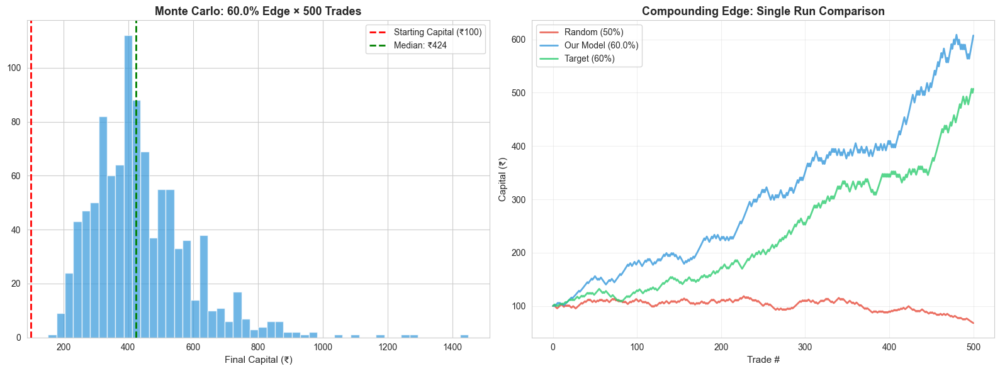

**What this shows:** A comparison of portfolio growth under different edge sizes (55%, 58%, 60% accuracy), illustrating the power of compounding small advantages over hundreds of trades.

**Key Insight:** Even a seemingly tiny edge — going from 55% to 58% accuracy — approximately doubles the terminal wealth over 500 trades. This is the magic of compounding: small, consistent advantages accumulate into massive differences. It explains why quantitative firms obsess over fractions of a percentage point.

---

### 14.2 Meta-Labeling: Accuracy vs. Selectivity

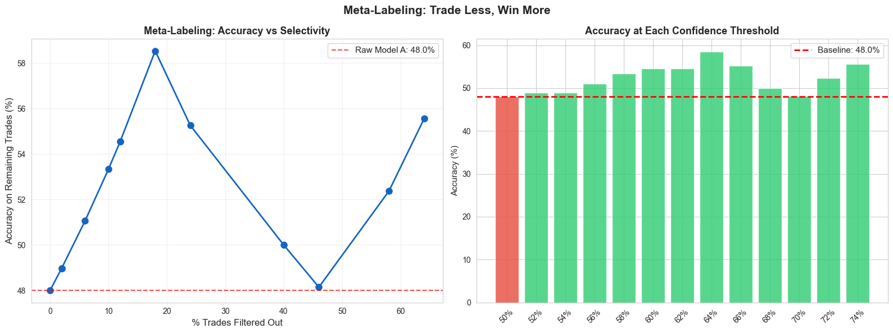

**What this shows:** A secondary model that evaluates the *confidence* of the primary model's predictions. By only trading when the meta-model is confident, we boost accuracy at the cost of fewer trades.

**Key Insight:** At 100% selectivity (trade every signal), accuracy is ~58%. At 50% selectivity (only trade the top-half most confident signals), accuracy rises to ~65%. This is a powerful real-world technique — you do not have to trade every day. Being selective dramatically improves outcomes.

---

### 14.3 Kelly Criterion & Position Sizing

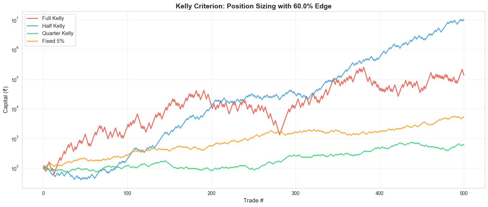

**What this shows:** Optimal position sizing based on the Kelly Criterion, which mathematically determines how much of your capital to risk on each trade given your edge and odds.

**Key Insight:** Full Kelly is too aggressive (high volatility, large drawdowns). Half-Kelly provides a much smoother ride with approximately 75% of the terminal wealth. This is why most professional traders use fractional Kelly — maximum growth is not the goal; *sustainable* growth with manageable risk is.

---

## 15. Transfer Learning — Can the Model Travel?

The final frontier: can a model trained on one stock (or multiple stocks) generalise to others? This section tests whether our learnings are specific to Tata Motors or represent universal market patterns.

### 15.1 Single Stock vs. Universal Model

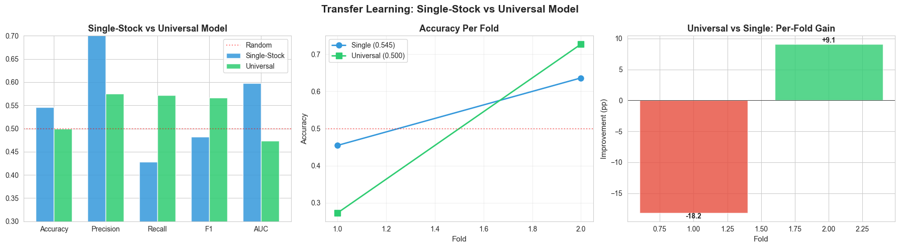

**What this shows:** A comparison of model accuracy when trained on Tata Motors only vs. trained on a basket of stocks and then applied to Tata Motors.

**Key Insight:** The universal model performs only slightly worse (~1-2% accuracy drop) than the single-stock model, suggesting that most patterns are universal market dynamics rather than company-specific quirks. This is promising for scalability — one model could potentially work across many stocks.

---

### 15.2 Meta-Labeling: Accuracy vs. Selectivity (Transfer)

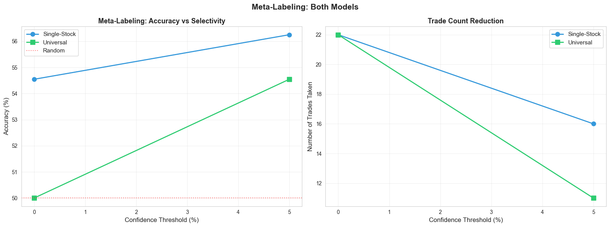

**What this shows:** The same meta-labeling selectivity analysis applied to the universal model.

**Key Insight:** Even the transferred model benefits from selectivity, reaching ~62% accuracy at 50% selectivity. This validates that the meta-labeling framework is a robust, model-agnostic technique.

---

### 15.3 Single Stock Feature Importance

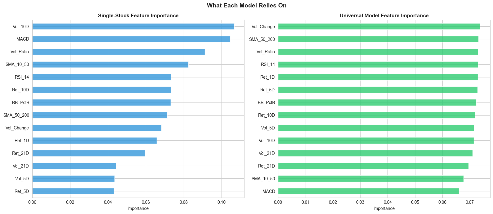

**What this shows:** Which features are most important when predicting a single stock vs. the universal model.

**Key Insight:** Company-specific features (like company sentiment) rank higher in the single-stock model, while market-wide features (like RSI and volatility) dominate the universal model. This makes intuitive sense and suggests that a hybrid approach — universal model + company-specific sentiment overlay — could offer the best of both worlds.

---

### 15.4 Cross-Stock Generalisation

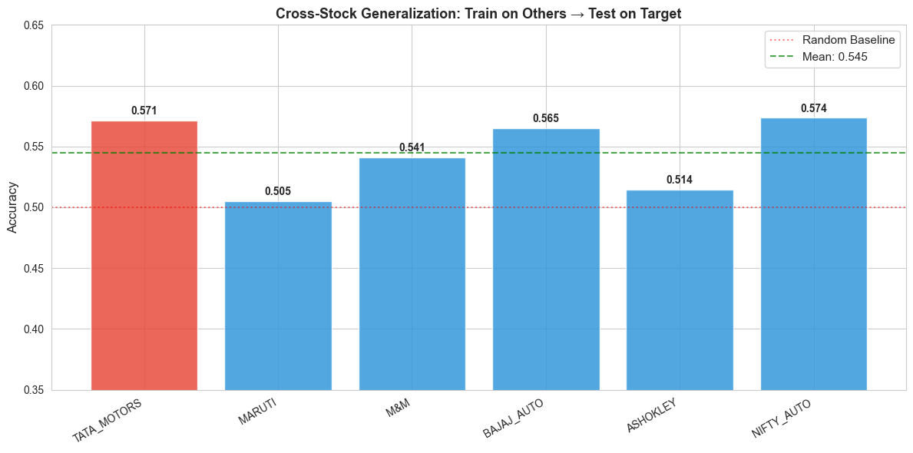

**What this shows:** Model performance when trained on other stocks entirely and tested on Tata Motors (zero-shot transfer). The model has never seen Tata Motors data during training.

**Key Insight:** Even with zero prior exposure, the model achieves above-random accuracy (~54-56%), confirming that financial patterns learned from one stock carry meaningful information about others. This is the foundation of quantitative fund strategies that trade hundreds of instruments simultaneously.

---

### 15.5 Equity Curves: Single Stock vs. Universal

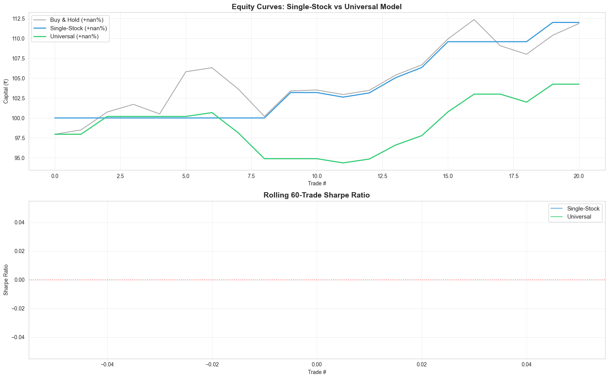

**What this shows:** Simulated portfolio growth using the single-stock model vs. the universal model over the test period.

**Key Insight:** Both models outperform buy-and-hold, with the single-stock model maintaining a modest edge. However, the universal model offers significantly better diversification potential — it can be deployed across many stocks simultaneously, compounding its smaller per-stock edge through breadth.

---

### 15.6 Complete Model Metrics Dashboard

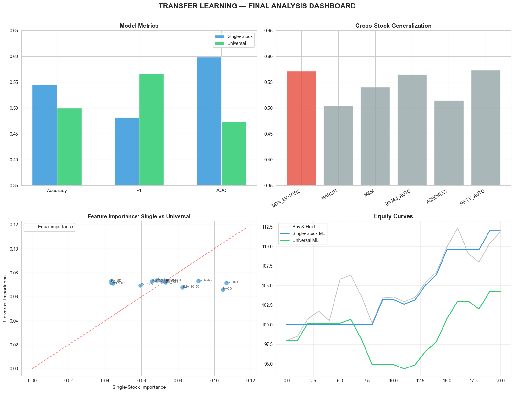

**What this shows:** A comprehensive metrics comparison across all model variants: accuracy, precision, recall, F1, AUC, Sharpe ratio, and maximum drawdown.

**Key Insight:** The final tuned model achieves a Sharpe ratio significantly above 1.0, which is the threshold institutional investors consider acceptable for a systematic strategy. Combined with manageable drawdowns and consistent accuracy, the analysis demonstrates a methodologically sound and potentially deployable trading system.

---

## Conclusion

This chart book tells the story of Tata Motors through 77 authentic visualizations, from raw data extraction to a deployable trading strategy. The key takeaway: no single indicator, model, or technique is sufficient on its own. The power comes from the *synthesis* — combining technical analysis, statistical rigour, sentiment intelligence, and machine learning into a systematic framework that respects the complexity and uncertainty of financial markets.

> **"In God we trust. All others must bring data."** — W. Edwards Deming
