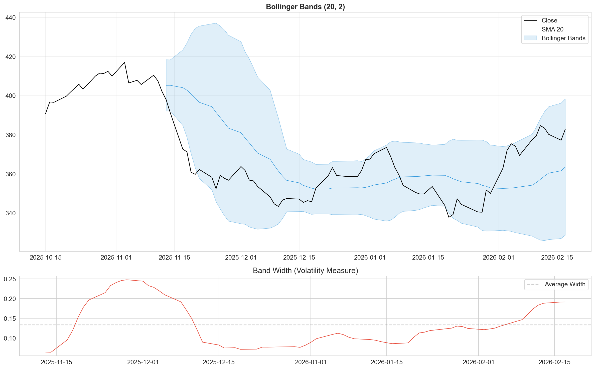
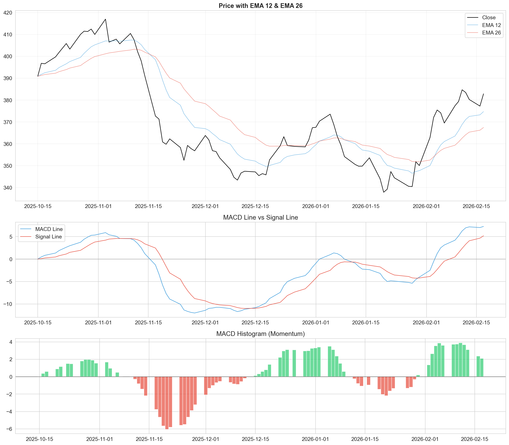

# Technical Analysis Report - Tata Motors

This report summarizes the technical indicator analysis performed on Tata Motors' historical data. We have calculated and visualized key momentum, trend, and volatility indicators to understand the stock's behavior during major market events like the COVID crash and the October 2024 crash.

## 1. Price Momentum & Direction

### Daily Price Change
We analyzed the daily directional moves to identify periods of sustained buying or selling pressure.

**Observation:**
- The **COVID Crash (March 2020)** is visible as a cluster of large red bars, indicating consecutive days of heavy selling.
- The **Recovery (2020-2021)** shows a healthy mix of green bars, with pullbacks being relatively shallow.
- The **Oct 2024 Crash** shows a sudden shift to red, similar in intensity to early COVID days but shorter in duration.

### Gains vs Losses (Magnitude)
This chart separates the *size* of up-moves vs down-moves to see which side is stronger.

**Observation:**
- During the **2021 Bull Run**, the green area (Gains) consistently overwhelms the red area.
- In **Oct 2024**, we see a spike in the red area (Loss magnitude), confirming that sellers were aggressive and drove prices down significantly on down days.

---

## 2. Trend Strength (RSI Components)

To understand RSI, we smoothed the average gains and losses over a 14-day period.

**Observation:**
- **Bullish Momentum (Green Shade):** When the green line (Avg Gain) is above the red line (Avg Loss), the trend is strongly up. This was dominant from mid-2020 to late 2021.
- **Bearish Momentum (Red Shade):** The crossover where the red line spikes above the green line signals a trend reversal. We see a sharp crossover in **Oct 2024**, validating the crash as a structural shift, not just noise.

---

## 3. Volatility & Trend Reversal

### Bollinger Bands & Volatility
Bollinger Bands help us visualize volatility. When the bands widen, volatility is high.

**Observation:**
- The bands **widened significantly** during the COVID crash and again in Oct 2024, signaling extreme uncertainty.
- Price touching the **lower band** is often a buy signal in a mean-reverting market, but in a strong crash (like Oct 2024), the price can "ride the bands" down for weeks.

### MACD (Moving Average Convergence Divergence)
MACD serves as our primary trend-following indicator.

**Observation:**
- **Bearish Crossover:** A MACD sell signal (MACD line crossing below Signal line) was generated *just before* the Oct 2024 crash accelerated, offering a potential early warning.

---

## Conclusion
The technical analysis confirms that the **October 2024 crash** was a significant technical event, characterized by:
1. **High Selling Pressure:** Evident in the Gains vs Losses chart.
2. **Momentum Shift:** Confirmed by the Smoothed Averages crossover.
3. **Trend Breakdown:** Validated by MACD and Bollinger Band breakdown.

This data suggests that the drop was driven by strong institutional selling (verified by Volume/OBV analysis in the notebook) rather than just retail panic.
